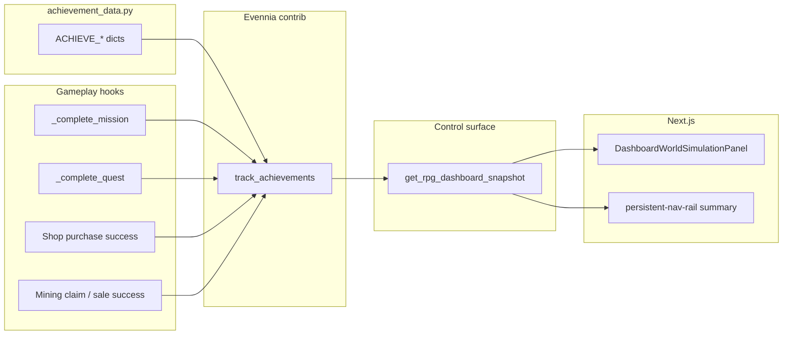

# Achievements: World Status UI, expanded defs, and game wiring

## Current behavior (baseline)

- **Summary in nav:** `[frontend/aurnom/components/persistent-nav-rail.tsx](frontend/aurnom/components/persistent-nav-rail.tsx)` shows `completed / total` from `character.achievements`.
- **Payload source:** `[game/typeclasses/characters.py](game/typeclasses/characters.py)` `get_rpg_dashboard_snapshot()` merges RPG fields into the control surface via `[game/web/ui/control_surface.py](game/web/ui/control_surface.py)` `_serialize_character_block()`.
- **Evennia contrib:** Definitions load from `[game/world/achievement_data.py](game/world/achievement_data.py)` (`ACHIEVEMENT_CONTRIB_MODULES` in `[game/server/conf/settings.py](game/server/conf/settings.py)`). Progress is stored on the character’s achievements attribute; updates go through `track_achievements` from `[evennia/contrib/game_systems/achievements/achievements.py](evennia/contrib/game_systems/achievements/achievements.py)`.
- **Level-based wiring:** `[game/world/progression.py](game/world/progression.py)` `add_xp()` calls `track_achievements` on level-ups. `Character.grant_xp` is the only path into `add_xp`. **Missions and quests already grant XP** when `rewards["xp"] > 0` via `[game/world/progression.py](game/world/progression.py)` `apply_reward_xp()` from `[game/typeclasses/missions.py](game/typeclasses/missions.py)` `_apply_rewards` and `[game/typeclasses/quests.py](game/typeclasses/quests.py)` `_apply_rewards`. So the two existing progression achievements *can* advance in normal play when XP rewards trigger level-ups; they do **not** advance on XP that does not cross a level threshold.

## Target architecture

## 1) JSON contract: detailed list + keep summary

**Goal:** World Status can render names, descriptions, progress, and completion without extra round-trips.

- Add a **single helper module** (e.g. `[game/world/achievement_snapshot.py](game/world/achievement_snapshot.py)`) that:
  - Imports `all_achievements` and `get_achievement_progress` from the contrib.
  - For each definition key, computes:
    - `completed` (boolean from stored progress).
    - `locked` (prerequisites not all completed — mirror the contrib’s prereq idea: all keys in `prereqs` must have `completed` in stored data before the achievement is “active”).
    - `progress` / `target`: for standard `tracking_type` sum achievements, expose numeric `progress` and `target` from the def’s `count` (default 1). For `separate` / list-shaped progress, either serialize minimally (array + target) or document that the first version only supports scalar progress in the UI (pick one and stay consistent).
  - Returns both `**summary`** `{ completed, total }` and `**items**` (stable sort: e.g. category then name, completed last or first — choose one ordering and test it).
- Update `[game/typeclasses/characters.py](game/typeclasses/characters.py)` `get_rpg_dashboard_snapshot()` to set:
  `achievements: { completed, total, items: [...] }`
  Keep `**completed` and `total`** so existing nav behavior stays valid.
- Update `[frontend/aurnom/lib/control-surface-api.ts](frontend/aurnom/lib/control-surface-api.ts)`: extend `CsAchievementsSummary` (or introduce `CsAchievementsBlock` with summary + items) so TypeScript matches the server.

**Contract discipline:** If a field is required in the UI, the server should always send it for authenticated puppet snapshots (avoid optional “maybe missing” shapes for the same route).

## 2) World Status UI

- Update `[frontend/aurnom/components/dashboard-world-simulation-panel.tsx](frontend/aurnom/components/dashboard-world-simulation-panel.tsx)`:
  - Extend `Props` with `achievements` (the new block or `null`).
  - Add a `SectionCard` (e.g. title **Achievements** or **Milestones**) listing each item: name, short status (complete / locked / progress `n/m`), description as secondary text or tooltip to keep density consistent with other sections.
  - Reuse existing typography / border patterns already in that file.
- Thread props from callers:
  - `[frontend/aurnom/app/(with-missions)/layout.tsx](frontend/aurnom/app/(with-missions)`/layout.tsx)
  - `[frontend/aurnom/components/control-surface-main-panels.tsx](frontend/aurnom/components/control-surface-main-panels.tsx)`
  Pass `data.character?.achievements ?? null` (or the new field name).
- **Optional:** Keep the nav rail row as-is (summary only) or add a one-line “see World status” hint — only if it reduces confusion; default is leave nav as summary-only.

## 3) Expand `achievement_data.py`

Add a **small, coherent first wave** (avoid dozens of untracked stubs):

| Theme    | Example keys                 | Category / tracking              | Count | Hook                                                                                                                 |
| -------- | ---------------------------- | -------------------------------- | ----- | -------------------------------------------------------------------------------------------------------------------- |
| Missions | First mission complete       | `missions` / `mission_completed` | 1     | `_complete_mission`                                                                                                  |
| Missions | Veteran operator (e.g. 10)   | `missions` / `mission_completed` | 10    | same                                                                                                                 |
| Quests   | First quest complete         | `quests` / `quest_completed`     | 1     | `_complete_quest`                                                                                                    |
| Quests   | Story runner (e.g. 5 quests) | `quests` / `quest_completed`     | 5     | same                                                                                                                 |
| Economy  | First catalog purchase       | `economy` / `catalog_purchase`   | 1     | successful buy in `[game/commands/shop.py](game/commands/shop.py)`                                                   |
| Mining   | First claimed site           | `mining` / `mining_site_claimed` | 1     | successful claim path in `[game/commands/mining.py](game/commands/mining.py)` (single choke point after persistence) |

Use **distinct** `category` and `tracking` strings per row above so contrib filtering stays unambiguous. Add `name` / `desc` suitable for the web UI.

**Prereqs (optional):** If you chain achievements (e.g. “Veteran operator” requires “First mission”), use the contrib’s `prereqs` field; ensure the snapshot helper marks `locked` correctly.

## 4) Wire `track_achievements` at real completion points

- `[game/typeclasses/missions.py](game/typeclasses/missions.py)`: at the end of `_complete_mission` (after rewards and state mutation), call `track_achievements(self.obj, category="missions", tracking="mission_completed", count=1)`. Optionally add a second call with `tracking=tmpl["id"]` for template-specific achievements if you add defs with that tracking id.
- `[game/typeclasses/quests.py](game/typeclasses/quests.py)`: at the end of `_complete_quest`, same pattern with `category="quests"`, `tracking="quest_completed"`, and optional per-template tracking.
- `[game/commands/shop.py](game/commands/shop.py)`: after a successful purchase (both normal item and random-claim branches if both count as “catalog purchase”), one `track_achievements` for `economy` / `catalog_purchase`.
- `[game/commands/mining.py](game/commands/mining.py)`: identify the **single** successful-return path after a site is claimed and persisted; call `track_achievements` once there (avoid double-count on retries).

**Centralization (optional but cleaner):** tiny wrappers in `[game/world/achievement_hooks.py](game/world/achievement_hooks.py)` (e.g. `track_mission_completed(char, template_id=None)`) that only forward to `track_achievements` — keeps category strings in one file.

## 5) Tests

- **Snapshot helper:** New tests in e.g. `[game/world/tests/test_achievement_snapshot.py](game/world/tests/test_achievement_snapshot.py)` — given a fake achiever or mocked progress data, assert JSON shape, `locked` logic with prereqs, and `completed`/`total` match item tallies.
- **Integration-style (light):** Extend or add tests that mission/quest completion triggers `track_achievements` (mock the contrib function) similar to patterns in `[game/world/tests/test_progression_xp_rewards.py](game/world/tests/test_progression_xp_rewards.py)`.

## 6) Non-goals / follow-ups

- Do not add a **separate** REST endpoint unless control-surface payload size becomes an issue; the missions layout already polls control surface.
- Achievements **command** (`CmdAchieve`) can stay as-is; web is read-only mirror of the same attribute data.
- If mission JSON rarely includes `xp`, level-based achievements will still be slow; fixing that is **content/balance**, not code — the plan above adds **mission/quest completion** tracks that do not depend on leveling.

## Risk notes

- **Payload size:** If `items` grows large, consider capping description length server-side or paginating later; first wave (~10–15 defs) is negligible.
- **Key conflicts:** New keys must be unique globally in `_ACHIEVEMENT_DATA` (settings already warn on duplicates).

