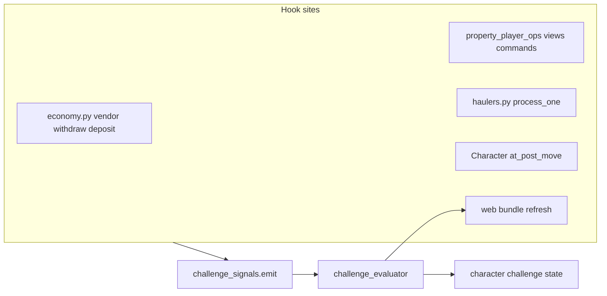
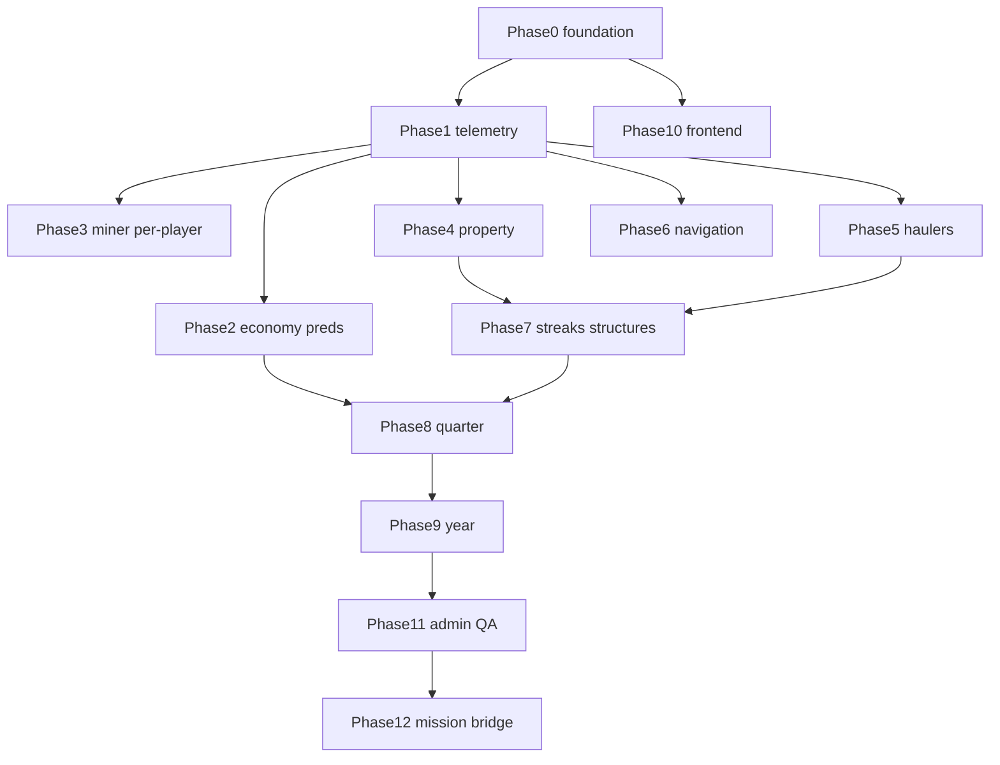

# Phased implementation: cadence challenges (full idea catalog)

## Scope and inventory

This plan covers **all ideas recommended across the three design passes**:

1. **Generic catalog** (first message): daily loops (quick/medium/themes), weekly arcs, monthly sagas, quarter/6mo/year frames, and cross-cutting knobs.
2. **Aurnom-tuned catalog** (second message): credits/property/extraction/venue/social/puzzle items mapped to deeds, holdings, haulers, locator zones, economy/treasury.
3. **Predicate-tagged catalog** (third message): economy transactions, holding fields, hauler state, venue/locator checks, and explicit caveats (per-player miner telemetry, visit logs).

**Grouping for implementation:** many generic items collapse onto the **same predicate** (e.g. “patrol N waypoints” = `visit_room` set or `locator_zone` distinct count). The appendix below lists **concrete challenge IDs** so nothing is dropped; phases deliver **infrastructure first**, then **content waves** that instantiate those IDs.

---

## Architectural decision

**Keep narrative missions and cadence challenges separate.**

- Story system today: `[game/typeclasses/missions.py](game/typeclasses/missions.py)`, `[game/world/mission_loader.py](game/world/mission_loader.py)`, `[game/world/data/mission_templates.json](game/world/data/mission_templates.json)` (currently empty), wired from `[game/web/ui/views.py](game/web/ui/views.py)` / `[game/web/ui/control_surface.py](game/web/ui/control_surface.py)`.
- Cadence content needs **time windows**, **numeric predicates**, **idempotent completion**, **reward claim**, and **high-volume telemetry** — overloading `_ALLOWED_OBJECTIVE_KINDS` in `mission_loader.py` would blur story and ops.

**Add a parallel module family** under `game/world/challenges/` plus a `Character` lazy handler (same pattern as `character.missions` in `[game/typeclasses/characters.py](game/typeclasses/characters.py)`).

---

## Data model (all phases depend on this)

**Per-character state** (Attribute `category="challenges"` or `db.challenges_v1`):

- `schema_version`
- `windows`: last evaluated UTC keys for `daily`, `weekly`, `monthly`, `quarter`, `half_year`, `year` (derive keys via `[world/time.py](game/world/time.py)`: reuse `start_of_utc_day`, `floor_period`; add `iso_week_start` / `utc_month_start` / `utc_quarter_start` helpers as needed).
- `active`: list of `{challengeId, windowKey, progress dict, status: in_progress|complete|claimed}`
- `history`: ring buffer of completions (for anti-fraud and UI “recent wins”).
- `telemetry`: bounded structures updated only by hooks, e.g.:
  - `visit_zones_today`: set or distinct count of `locator_zone_for_room` from `[game/world/locator_zones.py](game/world/locator_zones.py)`
  - `rooms_visited_window`: optional ring buffer of `room.id`
  - `balance_snapshot_start_of_day`: int
  - `hauler_events_today`: count
  - `property_ops_touched_window`: bool / timestamps

**Challenge definition file** (new): e.g. `[game/world/data/challenge_templates.json](game/world/data/challenge_templates.json)` validated by `[game/world/challenge_loader.py](game/world/challenge_loader.py)`.

Suggested fields per template: `id`, `cadence`, `title`, `summary`, `predicate` (string key + params), `rewards`, `eligibility` (min properties / tags), `requiresTelemetry` (for docs).

**Evaluator** (`[game/world/challenge_evaluator.py](game/world/challenge_evaluator.py)`):

- `on_event(character, event_name, payload)` — cheap incremental updates.
- `evaluate_window(character, cadence)` — run when window rolls or on login/web refresh; mark `complete` once per `(challengeId, windowKey)`.

**Global script** (optional): low-frequency tick (e.g. 60s) to roll windows for online players only if you need real-time midnight completion without web hit; otherwise **evaluate on login + web bundle** may suffice initially.

---

## Appendix A — Master challenge ID checklist (every recommended idea)

*Each line is one implementable template; generic ideas that duplicate a predicate share one ID with copy variants.*

### Daily — economy / credits

| ID                           | Source idea                                                     |
| ---------------------------- | --------------------------------------------------------------- |
| `daily.balance_net_positive` | Net-positive trading day                                        |
| `daily.balance_after_fee`    | Pay fee, end above prior snapshot                               |
| `daily.treasury_touch`       | Any tx touching treasury account / tax memos                    |
| `daily.vendor_purchase`      | At least one vendor sale                                        |
| `daily.vendor_spend_cap`     | Spend ≤ K credits at vendors (variant)                          |
| `daily.black_market_flavor`  | Use black-market rates path if exposed in commands              |
| `daily.arbitrage_note`       | Net positive + ≥2 distinct `vendor_id` purchases (ledger memos) |

### Daily — property / realty

| ID                               | Source idea                                                    |
| -------------------------------- | -------------------------------------------------------------- |
| `daily.visit_parcel_shell`       | `place_state.root_room_id` location match                      |
| `daily.property_operation_touch` | Web/cmd `start_property_operation_for_owner` / `startproperty` |
| `daily.deed_on_person`           | All `property_claim` deeds in `char.contents` at EOD snapshots |
| `daily.locator_zone_bingo`       | N distinct locator zones (needs move hook + telemetry)         |
| `daily.open_or_visit_property`   | `openproperty` / `visitproperty` command hooks                 |

### Daily — extraction / logistics

| ID                                | Source idea                                                          |
| --------------------------------- | -------------------------------------------------------------------- |
| `daily.hauler_cycle`              | Hauler state transition / `hauler_process_one` success               |
| `daily.mining_slot_participation` | Per-player miner payout (needs `record_miner_treasury_payout` extra) |
| `daily.triple_pipeline_touch`     | mining + flora + fauna site owner or deposit event                   |
| `daily.single_mine_deposit`       | Mining deposit interaction (existing mining cmd hooks)               |

### Daily — venues / navigation (generic + tuned)

| ID                                            | Source idea                                          |
| --------------------------------------------- | ---------------------------------------------------- |
| `daily.venue_tour_hub_bank_plant_shop_realty` | `room.db.venue_id` + `world.venues.VENUES` room keys |
| `daily.visit_three_waypoints`                 | Generic patrol — `visit_room` key list               |
| `daily.escort_lite`                           | If escort exists; else defer                         |
| `daily.stealth_zone`                          | If stealth/alert exists; else defer                  |
| `daily.arrival_zone_visit`                    | `locator_zone == arrival`                            |

### Daily — social / meta (generic + tuned)

| ID                     | Source idea                                                                     |
| ---------------------- | ------------------------------------------------------------------------------- |
| `daily.trade_once`     | Successful give/trade command hook                                              |
| `daily.read_dashboard` | Server-side only if API records acknowledgment; else client-trust flag          |
| `daily.lore_trivia`    | `interaction` key via NPC (reuse mission `sync_interaction` or challenge event) |

### Daily — puzzles (generic + tuned)

| ID                      | Source idea                                         |
| ----------------------- | --------------------------------------------------- |
| `daily.lot_riddle_room` | Stand in `room.key` / lot clue                      |
| `daily.ledger_acrostic` | Curated memos (staff-only) or abandon for fair play |

### Daily — themes (Mon–Sun)

| ID                           | Source idea                                            |
| ---------------------------- | ------------------------------------------------------ |
| `daily.monday_inventory`     | Count items in inventory snapshot                      |
| `daily.tuesday_combat_drill` | Combat interaction / spar NPC                          |
| `daily.wednesday_puzzle`     | Puzzle interaction key                                 |
| `daily.thursday_social`      | trade/chat interaction                                 |
| `daily.friday_risk`          | Purchase ≥ K cr single tx                              |
| `daily.weekend_coop`         | Optional: require party tag — defer if no party system |

### Weekly

| ID                                 | Source idea                                                                |
| ---------------------------------- | -------------------------------------------------------------------------- |
| `weekly.property_operation_streak` | `operation.paused` false all 7 snapshots or `ledger.credits_accrued` delta |
| `weekly.hauler_throughput`         | K hauler completions across ≥2 mine `venue_id` or locator zones            |
| `weekly.deed_market_action`        | `buy_listed_property_deed` or listing created                              |
| `weekly.primary_deed_purchase`     | `purchase_property_deed`                                                   |
| `weekly.access_control_change`     | `holding.db.access` managers/tenants delta                                 |
| `weekly.refinery_diversity`        | N distinct refined resources — needs collect hook                          |
| `weekly.guild_pool`                | Faction pooled contributions — defer until faction object exists           |
| `weekly.mystery_seven_logs`        | Seven daily interaction seeds — narrative wrapper                          |

### Monthly

| ID                             | Source idea                                              |
| ------------------------------ | -------------------------------------------------------- |
| `monthly.portfolio_two_zones`  | Two distinct `holding.db.zone` or `lot.db.venue_id`      |
| `monthly.two_operation_kinds`  | `operation.kind` distinct count                          |
| `monthly.development_not_idle` | `development_state != idle`                              |
| `monthly.operation_level`      | `operation.level >= L`                                   |
| `monthly.tax_contribution`     | Sum tax from player-linked vendor txs                    |
| `monthly.locator_cartography`  | N new rooms first-seen                                   |
| `monthly.raid_lite`            | Boss/interaction sequence — defer or map to Marcus stack |
| `monthly.world_boss_async`     | Server pool damage — defer                               |

### Quarter

| ID                                  | Source idea                                                        |
| ----------------------------------- | ------------------------------------------------------------------ |
| `quarter.district_track_industrial` | Time-on-zone or task count for `industrial-colony`                 |
| `quarter.district_track_killstar`   | Same for `killstar-annex`                                          |
| `quarter.district_track_meridian`   | Same for `meridian-shipping`                                       |
| `quarter.deed_buy_hold_sell`        | Sequence + optional profit                                         |
| `quarter.multi_holding_managers`    | ≥2 holdings with char in `access.managers`                         |
| `quarter.economy_modifier_shift`    | Compare `EconomyEngine.db.state` global_modifier quarter start/end |

### Six months

| ID                              | Source idea                                          |
| ------------------------------- | ---------------------------------------------------- |
| `half_year.claim_to_skyline`    | Lot: operation + structures count + slots used       |
| `half_year.pipeline_specialist` | Income fraction by memo bucket — needs tagged income |
| `half_year.reputation_rehab`    | Standing — defer until standing per character exists |
| `half_year.rival_npc`           | Narrative — tie to missions + challenge unlock       |

### Year

| ID                                 | Source idea                                |
| ---------------------------------- | ------------------------------------------ |
| `year.almanac_twelve`              | Twelve monthly sub-challenges              |
| `year.title_odyssey_venues`        | Visit all `VENUES` keys                    |
| `year.title_odyssey_locator_zones` | Visit all zone ids from `locator_zones`    |
| `year.ledger_lifetime_milestone`   | Cumulative tx volume / balance tier        |
| `year.anniversary_deed`            | Continuous title for 365d — daily snapshot |

### Cross-cutting / generic (first message) mapped

| ID                            | Source idea                      |
| ----------------------------- | -------------------------------- |
| `daily.single_node_puzzle`    | interaction key                  |
| `daily.resource_tick_deliver` | give item to NPC/room container  |
| `daily.craft_once`            | crafting hook if present         |
| `daily.repair_maintain`       | structure repair hook if present |
| `daily.duel_spar`             | combat cmd                       |
| `daily.photo_snapshot`        | non-mechanical / defer           |
| `weekly.boss_rotation`        | NPC interaction week tag         |
| `weekly.territory_influence`  | holding ops + PvP defer          |
| `weekly.blueprint_assembly`   | multi-day crafting — defer       |
| `monthly.collection_codex`    | item/tag set — defer             |
| `monthly.narrative_act`       | mission thread — use missions    |
| `quarter.saga_three_acts`     | missions + challenge gates       |
| `quarter.prestige_path`       | reset mechanic — defer           |
| `year.oath_constraint`        | voluntary rule flag on character |

**Deferred items** are explicitly listed so they are not “lost”; they ship in the phase where the underlying mechanic exists or as narrative-only missions.

---

## Phase 0 — Foundation and API surface

- Add `world/challenges/` package: `__init__.py`, `challenge_loader.py`, `challenge_handler.py`, `challenge_evaluator.py`, `challenge_signals.py`, `predicates/` (one module per domain: `economy.py`, `property.py`, `extraction.py`, `navigation.py`).
- Add `Character.challenges` lazy property mirroring `[characters.py](game/typeclasses/characters.py)` `missions` pattern.
- Define JSON schema + validation; empty template file with 2–3 **canary** challenges for dev.
- Add `serialize_for_web()` on handler for `[control_surface.py](game/web/ui/control_surface.py)` / `[views.py](game/web/ui/views.py)` alongside missions.
- Document UTC window key functions in `[world/time.py](game/world/time.py)` (add missing calendar helpers).

## Phase 1 — Telemetry primitives (unblocks honest predicates)

- **Movement:** override `at_post_move` on `[game/typeclasses/characters.py](game/typeclasses/characters.py)` `Character` (or mixin) to call `challenge_signals.emit("room_enter", …)` and increment zone distinct sets for current daily window. Also call existing `caller.missions.sync_room` here if not already centralized (today duplicated in several commands) — optional consolidation to single pipeline.
- **Balance snapshots:** at start of UTC day (first event of day), store `balance_snapshot` from `get_economy().get_character_balance`.
- **Property op touch:** in `[start_property_operation_for_owner](game/typeclasses/property_player_ops.py)` (used by `[property_start_operation](game/web/ui/views.py)`) and the in-game `startproperty` command, emit `property_operation_started`.
- **Vendor purchases:** after `[CatalogVendor.record_sale](game/typeclasses/shops.py)`, emit `vendor_sale` with `vendor_id`, `price`, `tax_amount`.
- **Treasury/tax:** same hook or `record_transaction` wrapper — emit `treasury_credit` when `to_account` matches `get_treasury_account`.

## Phase 2 — Economy predicate pack (daily + weekly subsets)

- Implement predicate functions backed by `economy.db.transactions` filtered by timestamp and `player:{id}` accounts (see `[record_transaction` shape](game/typeclasses/economy.py)).
- Ship templates: `daily.balance_net_positive`, `daily.treasury_touch`, `daily.vendor_purchase`, `weekly.tax_contribution` (partial month/week).
- **Performance cap:** scan last N transactions or index by time in state (if ledger grows large, add rolling per-player counters updated on each tx — same phase if needed).

## Phase 3 — Per-player mining / plant settlement telemetry

- Extend `[record_miner_treasury_payout](game/typeclasses/economy.py)` to accept optional `character_id` / `player_account` in call sites from refining/settlement paths (grep callers).
- Emit `miner_payout` event with `slot_iso` matching `MINING_DELIVERY_PERIOD` grid.
- Ship `daily.mining_slot_participation` and refine `daily.triple_pipeline_touch` using site ownership from mining/flora/fauna typeclasses (tags already used in `[haulers.py](game/typeclasses/haulers.py)`).

## Phase 4 — Property and deed predicates

- Hooks: `[buy_listed_property_deed](game/typeclasses/property_deed_market.py)`, `[purchase_property_deed](game/typeclasses/property_claim_market.py)`, deed `at_give` / transfer fee path `[property_claims.py](game/typeclasses/property_claims.py)`, `visitproperty` / `openproperty` commands (grep `openproperty` in `game/commands`).
- Ship: `daily.visit_parcel_shell`, `daily.property_operation_touch`, `weekly.deed_market_action`, `weekly.primary_deed_purchase`, `monthly.portfolio_two_zones`, `monthly.two_operation_kinds`, `year.anniversary_deed` (snapshot job).

## Phase 5 — Hauler and extraction predicates

- In `[hauler_process_one](game/typeclasses/haulers.py)`, on successful work / state advance, emit `hauler_tick` with `mine_room`, `pipeline` (mining/flora/fauna).
- Ship: `daily.hauler_cycle`, `weekly.hauler_throughput`, `quarter.district_track_`* (zone derived from mine room via `locator_zone_for_room`).

## Phase 6 — Navigation and venue tours

- Predicate: visit set covers hub, bank reserve room, plant room, one shop, realty room for a given `venue_id` from `[world/venues.py](game/world/venues.py)`.
- Ship: `daily.venue_tour_*`, `daily.locator_zone_bingo`, `year.title_odyssey_venues`, `year.title_odyssey_locator_zones`.

## Phase 7 — Weekly / monthly streak and structure depth

- Nightly or on-evaluate: sample `holding.db.operation.paused` and `ledger.credits_accrued` for streak challenges.
- Structure counts via `[PropertyHolding.structures()](game/typeclasses/property_holdings.py)`.
- Ship: `weekly.property_operation_streak`, `monthly.development_not_idle`, `half_year.claim_to_skyline`.

## Phase 8 — Quarter and long-window registry

- Add window keys for ISO quarter and half-year; evaluate less frequently (login + dedicated endpoint).
- Ship: `quarter.economy_modifier_shift`, `quarter.deed_buy_hold_sell` (track state machine on character telemetry), `quarter.multi_holding_managers`.

## Phase 9 — Year and almanac

- `year.almanac_twelve` composed challenge: child ids = 12× `monthly.*` flags or lightweight monthly check-ins.
- `year.ledger_lifetime_milestone`: maintain `db.challenge_lifetime_credits_moved` incremented on txs involving player (O(1) per tx).

## Phase 10 — Frontend (Next.js)

- Add panel to `[frontend/aurnom](frontend/aurnom)` (pattern match `[economy-treasury-live-flow-card.tsx](frontend/aurnom/components/economy-treasury-live-flow-card.tsx)` / control surface data fetch).
- Show active cadence, progress bars, claim button, completed history; handle unauthenticated state.

## Phase 11 — Admin, QA, and safety

- Staff command: reload templates, inspect character challenge state, grant test completion.
- Bounds: max telemetry list sizes, transaction scan limits, rate limits on evaluate.
- Unit tests: window math, predicate edge cases, idempotent completion.

## Phase 12 — Optional integration with narrative missions

- Completing selected challenges emits mission seeds via `[MissionHandler](game/typeclasses/missions.py)` `sync_global_seeds` / custom offer API.
- Generic “story” content from the first brainstorm migrates to `[mission_templates.json](game/world/data/mission_templates.json)` where it is **purely narrative** (visit/interaction/choice).

---

## Dependency ordering (summary)

---

## Risk notes

- **Transaction log growth:** long-term you may need summarized counters instead of full scans for lifetime/year predicates.
- **Web-only players:** ensure challenge evaluation runs on the same code paths as purchases (`views.py`) and on periodic web refresh (`[control_surface.py](game/web/ui/control_surface.py)`).
- **Fair play:** avoid client-only predicates unless cosmetic; `daily.read_dashboard` should be server-signaled or dropped.

