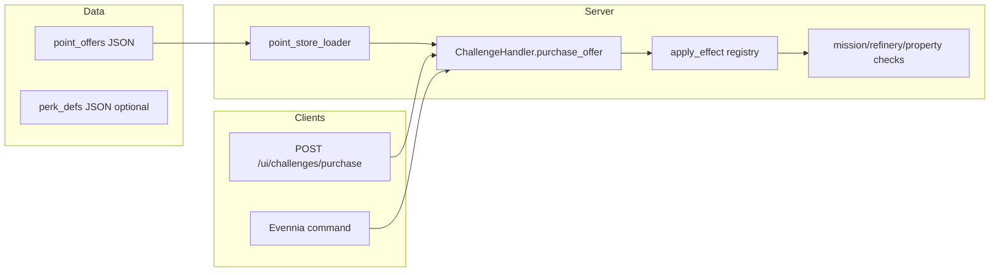

# Challenge point progression store

## Constraints (from you)

- **Credits never buy these effects.** The store is the only acquisition path for catalog items; shops and credit flows must not grant the same flags, traits, missions, recipes, or licenses. Enforce by convention in data + a single server-side “grant” path used only from point purchases.
- **Opaque tuning is OK.** Numeric effects live in JSON/Python the client does not need; the API can expose only **title, summary, category, price, availability** (and whether already purchased).

## Architecture

- **Catalog:** New JSON packs under `[game/world/data/point_offers.d/](game/world/data/point_offers.d/)` (same bulk-loader pattern as `[game/world/challenges/challenge_loader.py](game/world/challenges/challenge_loader.py)`): validated rows with `id`, `category`, `title`, `summary`, `costLifetime`, `costSeason` (non-negative ints; at least one must be > 0), optional `prerequisiteOfferIds`, optional `maxPurchasesPerCharacter`, and a server-only `**effect`** object (not echoed to the web client).
- **State:** Extend the existing challenge attribute blob managed by `[game/world/challenges/challenge_handler.py](game/world/challenges/challenge_handler.py)` (key `_challenges`, category `challenges`) via `_normalize()` with new keys, e.g. `pointPurchases` (map `offerId` → `{ purchasedAt, counts }` or ordered list for stackable ranks), `perkSlots`, `equippedPerks`, `licenseTiers`, `unlockedRefiningRecipes`, so **debit points + record purchase + apply effect** stay one `_save()` after validation.
- **Purchase entrypoint:** `ChallengeHandler.purchase_offer(offer_id) -> (ok, message)` (name flexible): load template → verify prerequisites and repeat caps → verify **lifetime/season balance** and (if `costSeason` > 0) optional **season match** using existing `season_id` / `points_season` fields → apply effect via a small **registry** (`world/point_store/effects.py`) → decrement `points_lifetime` / `points_season` → append purchase record → `_save()`.
- **Concurrency:** Mirror `[game/web/ui/views.py](game/web/ui/views.py)` `challenges_claim` pattern: short-lived cache lock `point_purchase:{user_id}` (or per-character) to prevent double-submit races.

## Pillar 1: Trait / skill steps

- **Effect shape (examples):** bump `TraitHandler` on `[game/typeclasses/characters.py](game/typeclasses/characters.py)` — e.g. `rpg_stats` or `rpg_skills` — via `trait.base += n`, `trait.mod += n`, or `trait.mult *= m` as defined only in catalog (opaque to players).
- **Bootstrap:** For new trait keys introduced only for the point store, add a small helper (e.g. `ensure_point_store_trait(character, key, defaults)`) called from the effect applier so first purchase creates the trait if missing (avoid editing every character at once).

## Pillar 2: Perk slots and perks

- **State:** `perkSlots` (int, base + purchases) and `equippedPerks` (ordered list of `perkId`, length ≤ slots).
- **Data:** Optional second registry `perk_defs` (same loader pattern or embedded in offer effects) mapping `perkId` → internal modifiers (raw % allowed per your preference).
- **Runtime:** Add `world/point_store/perk_resolver.py` with `aggregate_modifiers(character) -> dict` (or similar) used wherever you want perks to matter **first** (e.g. space engagement, mining yield, vendor fee — pick minimal initial hooks; stub OK with TODO if no call site yet). Keep aggregation **server-only**; do not expose numbers in `serialize_for_web`.

## Pillar 3: Mission / contract access

- **Offer effect:** Either (a) call existing `[MissionHandler._offer_template](game/typeclasses/missions.py)` with `sourceKey` like `point_store:{offer_id}` (same pattern as challenge unlocks in `[challenge_handler._maybe_unlock_missions](game/world/challenges/challenge_handler.py)`), and/or (b) set a **persistent unlock flag** used for eligibility.
- **Gating:** Extend `[game/world/mission_loader.py](game/world/mission_loader.py)` `eligibility` normalization to accept optional `requiresOfferIds: string[]` (or `requiresUnlockTags`). Update `[MissionHandler._eligible_for_template](game/typeclasses/missions.py)` to require every id/tag be satisfied by `pointPurchases` / a derived `unlock_tags` set on challenge state.
- **Data policy:** Missions that are **only** reachable via points use `trigger` kinds that never fire from seeds/rooms alone, or hard `requiresOfferIds` so free offers cannot appear.

## Pillar 4: Standing / licenses

- **State:** `licenseTiers: { licenseKey: int }` (or similar) on challenge state.
- **Effect:** Increment tier cap; optional separate offers for “unlock tier 2” vs “unlock tier 3”.
- **Consumers:** Add helper `character.challenges.license_tier(key) -> int` and thread checks into the commands or web ops that should respect clearance (pick 1–2 initial gates, e.g. a vendor interaction or refinery terminal, even if tier 0 is default for all today).

## Pillar 5: Blueprints (refining recipes)

- **Recipe metadata:** In `[game/typeclasses/refining.py](game/typeclasses/refining.py)` `REFINING_RECIPES`, add optional fields such as `pointsOfferId` or `requiresRecipeUnlock: true` + stable recipe key already in dict.
- **Unlock set:** `unlockedRefiningRecipes` on challenge state; purchase effect adds keys.
- **Enforcement:** `[game/typeclasses/refining.py](game/typeclasses/refining.py)` `process_recipe` (and `[game/world/refinery_web_ops.py](game/world/refinery_web_ops.py)` / `[game/web/ui/refinery_read_model.py](game/web/ui/refinery_read_model.py)`) filter: if recipe requires unlock, character must have key in set. **List/refine commands** only show recipes the character may use (so “opaque” does not mean “shows but fails”).
- **Credits rule:** No credit price path for these recipes; inputs/outputs still use normal credits/mats **after** the character is allowed to run the recipe.

## Season currency

- `**points_season` / `season_id`:** Today `[season_id](game/world/challenges/challenge_handler.py)` is stored but not rotated in code paths found. Plan includes: when `costSeason` > 0, reject purchase if `season_id` empty or offer tagged with a different `seasonId` (field on offer row). Add a **staff/admin command** (or script) `set_challenge_season <id>` that sets `season_id`, optionally resets `points_season`, and documents that seasonal offers cost `points_season` only.

## Web + UI

- **GET** extend `[serialize_for_web](game/world/challenges/challenge_handler.py)` with:
  - `pointOffers`: public slice of catalog (no `effect`)
  - `pointPurchases` summary / equipped perks / balances (already have `pointsLifetime`, `pointsSeason`)
- **POST** `[game/web/ui/views.py](game/web/ui/views.py)` + `[game/web/ui/urls.py](game/web/ui/urls.py)`: e.g. `challenges/purchase` with body `{ offerId }`, same auth as other `/ui/challenges/`*.
- **Frontend:** `[frontend/aurnom/lib/ui-api.ts](frontend/aurnom/lib/ui-api.ts)` extend `ChallengesState`; `[frontend/aurnom/components/challenges-panel.tsx](frontend/aurnom/components/challenges-panel.tsx)` (or sub-panel) list offers with buy button, disabled when unaffordable or locked; reuse patterns from `[frontend/aurnom/components/control-surface-main-panels.tsx](frontend/aurnom/components/control-surface-main-panels.tsx)` for API callbacks.

## In-game command

- New command under `[game/commands/](game/commands/)` (e.g. `pointshop` / `challenges buy`) calling the same `purchase_offer` for telnet/headless parity.

## Tests and safety

- Unit tests: loader validation, purchase idempotency / caps, insufficient points, prerequisite chain, mission eligibility with `requiresOfferIds`, refinery gate.
- **No fallback:** Invalid `effect` type or unknown recipe/mission id should **fail loudly** at purchase time (clear error to staff/logs), not silently no-op.

## Rollout order (recommended)

1. Loader + state keys + `purchase_offer` + web POST + minimal catalog (one offer per category smoke test).
2. Mission eligibility + one gated mission template.
3. Refining unlock + one locked recipe.
4. Perk slots + resolver + one hook.
5. License tier + one consumer check.
6. Frontend panel polish + admin season command.

