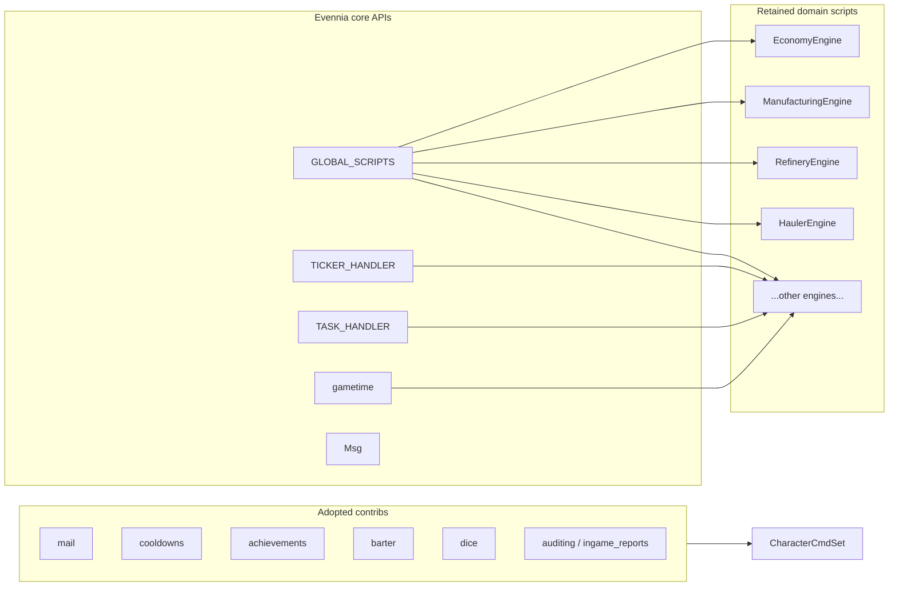

# Evennia structural alignment (keep domain engines)

## Constraint you chose

**Retain** industrial/economy/world engines that have **no stock contrib**; align them to **core Evennia primitives** (`DefaultScript` / `[game/typeclasses/scripts.py](game/typeclasses/scripts.py)`, `[GLOBAL_SCRIPTS](game/server/conf/settings.py)`, handlers, gametime) rather than deleting features.

## Reality check (so expectations match the code)

Evennia’s [contrib index](https://www.evennia.com/docs/latest/Contribs/Contribs-Overview.html) does **not** provide drop-in replacements for: global commodity pricing + demand, refinery/hauler/mining simulation, property/realty operation engines, mission seed queues, instance/parties, ambient/crime/battlespace world state. Those **already match** the standard Evennia pattern “one persistent `Script` singleton registered in `settings.GLOBAL_SCRIPTS`” (see `[EconomyEngine](game/typeclasses/economy.py)` docstring and implementation).

**Alignment** therefore means: (1) tighten **how** those scripts interact with **TICKER_HANDLER**, **TASK_HANDLER**, **gametime**, and **Msg**; (2) add **contribs** only where they **add** capability without replacing your sim; (3) remove **redundant** layers only after a contrib or core pattern subsumes them.

---

## Phase 1 — Core API normalization (all engines)

**1.1 `TASK_HANDLER` adoption**

- Today: **no** `TASK_HANDLER` usage under `[game/](game/)` (grep confirms). Many engines use `Script.interval` + `at_repeat` (`[at_server_startstop.py](game/server/conf/at_server_startstop.py)` patches several intervals from `[world/engine_tuning.py](game/world/engine_tuning.py)`).
- **Plan:** For **one-shot** or **reschedule-after-complete** work (discovery ETAs, hauler leg completion, delayed notifications), route through `**TASK_HANDLER`** per [Evennia task handler docs](https://www.evennia.com/docs/latest/api/evennia.scripts.taskhandler.html) instead of spawning short-lived `Script`s or stacking interval hacks.
- **Deliverable:** Per-engine audit document + refactors in engine modules under `[game/typeclasses/](game/typeclasses/)` (mining, haulers, site discovery, property lot discovery, economy automation, etc.) with tests where behavior is timing-sensitive.

**1.2 `TICKER_HANDLER` policy**

- Today: `[game/typeclasses/rooms.py](game/typeclasses/rooms.py)` subscribes/unsubscribes room environment ticks; tests in `[game/world/tests/test_room_environment_ticker.py](game/world/tests/test_room_environment_ticker.py)`.
- **Plan:** Write a short **project rule**: dense periodic work on **many** objects → `TICKER_HANDLER`; **singleton world step** → `Script` on `GLOBAL_SCRIPTS`. Refactor only where engines currently tick per-object in a loop and could subscribe instead (avoid premature churn).

**1.3 `gametime` single source of truth**

- Today: `[game/world/world_clock.py](game/world/world_clock.py)` wraps `evennia.utils.gametime`; `[TIME_GAME_EPOCH` / `TIME_FACTOR](game/server/conf/settings.py)` set IC scale; `[WorldClockScript](game/typeclasses/world_clock_script.py)` and world engines read snapshots.
- **Plan:** Ensure **no parallel time bases** (raw `time.time()` for IC logic except where explicitly “real wall clock”). Optionally evaluate [custom_gametime](https://www.evennia.com/docs/latest/Contribs/Contrib-Custom-Gametime.html) **only** if you later need non-Gregorian IC calendars; otherwise **skip** to avoid duplicating `[world_clock.py](game/world/world_clock.py)`.

**1.4 Typeclass and persistence conventions**

- Keep engine base as thin subclass of `DefaultScript` (`[game/typeclasses/scripts.py](game/typeclasses/scripts.py)`).
- Optionally migrate **hot, schema-stable** fields to `AttributeProperty` on Characters/Objects where it reduces ad-hoc `db` access (follow Evennia typeclass docs); **do not** mass-migrate without a migration note for existing DB attributes.

---

## Phase 2 — Supplemental contrib adoption (non-conflicting)

Wire through `[game/commands/default_cmdsets.py](game/commands/default_cmdsets.py)` (and Account cmdset where required by contrib docs). Follow each contrib’s **installation** section from the official doc pages.

| Contrib                                                                                                                                                                     | Role for this game                                      | Notes                                |
| --------------------------------------------------------------------------------------------------------------------------------------------------------------------------- | ------------------------------------------------------- | ------------------------------------ |
| [mail](https://www.evennia.com/docs/latest/Contribs/Contrib-Mail.html)                                                                                                      | IC/OOOC messaging, mission threads, contract follow-ups | Uses core `Msg`                      |
| [cooldowns](https://www.evennia.com/docs/latest/Contribs/Contrib-Cooldowns.html)                                                                                            | Rate-limit scans, market actions, combat abilities      | Attach to Character                  |
| [achievements](https://www.evennia.com/docs/latest/Contribs/Contrib-Achievements.html)                                                                                      | Milestones (first haul, tier unlocks)                   | Emit from existing progression hooks |
| [barter](https://www.evennia.com/docs/latest/Contribs/Contrib-Barter.html)                                                                                                  | Safe P2P trades (credits + goods)                       | Complements vendor economy           |
| [dice](https://www.evennia.com/docs/latest/Contribs/Contrib-Dice.html)                                                                                                      | Explicit random checks in text play                     | Optional GM rolls                    |
| [ingame_reports](https://www.evennia.com/docs/latest/Contribs/Contrib-Ingame-Reports.html) + [auditing](https://www.evennia.com/docs/latest/Contribs/Contrib-Auditing.html) | Player reports + staff audit trail                      | Ops                                  |

**Optional later wave (RP-heavy station play):** [rpsystem](https://www.evennia.com/docs/latest/Contribs/Contrib-RPSystem.html), [multidescer](https://www.evennia.com/docs/latest/Contribs/Contrib-Multidescer.html). Coordinate with `[Character](game/typeclasses/characters.py)` and web client text paths so `msg()` overrides do not break the Next.js pipeline.

**Buffs vs traits:** `[TraitHandler](game/typeclasses/characters.py)` is already in use. Adding [buffs](https://www.evennia.com/docs/latest/Contribs/Contrib-Buffs.html) requires a **single rule**: either traits own static stats and buffs own timed modifiers, or **skip buffs** to avoid two competing modifier systems.

---

## Phase 3 — Contribs we intentionally do **not** map (conflict or wrong fit)

These are **not** “stripped from the game”; they are **rejected as replacements** unless you later choose a ground-up redesign.

| Contrib                                                                                                                                                           | Why not map your custom system to it                                                                                                                                                                        |
| ----------------------------------------------------------------------------------------------------------------------------------------------------------------- | ----------------------------------------------------------------------------------------------------------------------------------------------------------------------------------------------------------- |
| [crafting](https://www.evennia.com/docs/latest/Contribs/Contrib-Crafting.html)                                                                                    | Your pipeline is JSON-driven workshops, holdings, refined keys, commodity demand (`[manufacturing.py](game/typeclasses/manufacturing.py)`); contrib recipes are tag/tool based and do not model that graph. |
| [containers](https://www.evennia.com/docs/latest/Contribs/Contrib-Containers.html) / [storage](https://www.evennia.com/docs/latest/Contribs/Contrib-Storage.html) | You already have mass storage, refining inventories, and taxonomy; merging risks duplicate inventory semantics. Revisit only if you unify “object inventory” UX.                                            |
| [extended_room](https://www.evennia.com/docs/latest/Contribs/Contrib-Extended-Room.html)                                                                          | Overlaps conceptually with `[WorldEnvironmentEngine](game/typeclasses/world_environment_engine.py)` + room tickers; pick one architecture, not both blind.                                                  |
| [XYZgrid](https://www.evennia.com/docs/latest/Contribs/Contrib-XYZGrid.html) / [wilderness](https://www.evennia.com/docs/latest/Contribs/Contrib-Wilderness.html) | Your world is hand-built hubs/venues + instancing; grid/wilderness are topology replacements, not alignments.                                                                                               |
| [turnbattle](https://www.evennia.com/docs/latest/Contribs/Contrib-Turnbattle.html)                                                                                | You have `[space_combat](game/commands/space_combat.py)` / battlespace engines; parallel combat frameworks need an explicit product decision.                                                               |
| [godotwebsocket](https://www.evennia.com/docs/latest/Contribs/Contrib-Godotwebsocket.html)                                                                        | You already ship a Next.js web client; second client stack is optional.                                                                                                                                     |
| [llm](https://www.evennia.com/docs/latest/Contribs/Contrib-Llm.html)                                                                                              | Policy/cost dependent; not required for alignment.                                                                                                                                                          |

---

## Phase 4 — What **can** be stripped after alignment (redundant custom)

Only remove code **after** a contrib or core pattern clearly replaces it:

- **Duplicate messaging** — if `mail` contrib covers character mail, remove any parallel custom “mailbox” commands/handlers (grep-driven cleanup).
- **Ad-hoc cooldown fields** on characters/commands → replace with `cooldowns` handler usage.
- **Unsafe P2P give/pay flows** → prefer `barter` for player trades (keep NPC/vendor flows on existing economy APIs).

**Not stripped (your “unmappable to contrib” list — they stay as standard `Script` engines):**  
`EconomyEngine`, `CommodityDemandEngine`, `EconomyAutomationController`, `EconomyWorldTelemetry`, `ManufacturingEngine`, `RefineryEngine`, `HaulerEngine`, `MiningEngine`, `FloraEngine`, `FaunaEngine`, `SiteDiscoveryEngine`, `NpcMinerRegistryScript`, property operation/discovery/events engines, `AmbientWorldEngine`, `CrimeWorldEngine`, `BattlespaceWorldEngine`, `WorldEnvironmentEngine`, `MissionSeedsScript`, `StationContractsScript`, `SystemAlertsScript`, `InstanceManager`, `PartyRegistry`, listing scripts (`claim_listings`, `property_listings`, etc.), and `[SpaceEngagement](game/typeclasses/space_engagement.py)` — **none** have a stock contrib twin; they remain **valid Evennia architecture**.

---

## Phase 5 — Registry, tests, and web contracts

- Extend `[game/world/tests/test_global_scripts_registry.py](game/world/tests/test_global_scripts_registry.py)` whenever `GLOBAL_SCRIPTS` keys change (e.g. if a contrib requires a global script — rare).
- Update `[game/web/ui/views.py](game/web/ui/views.py)` / `[control_surface.py](game/web/ui/control_surface.py)` only where new player-visible state (achievements, mail counts, cooldowns) should surface; keep JSON contracts explicit.

---

## Suggested implementation order

1. **TASK_HANDLER** pass on engines with ETA / deferred work (highest structural value).
2. **mail + cooldowns + achievements** (low coupling).
3. **barter** (touches economy UX; test with credits + cargo edge cases).
4. **dice + ops contribs** (staff/account cmdsets).
5. Optional RP wave and **buffs** only after a written modifier policy.

