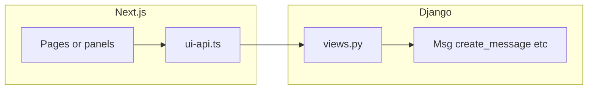

# Frontend contract, achievements UI, and web parity for contribs

## 1. Must-fix: TypeScript mirrors server JSON

### 1.1 Canonical shape

`[get_rpg_dashboard_snapshot()](game/typeclasses/characters.py)` returns (camelCase keys):

- `abilities`, `vitals`, `armorClass`, `level`, `xpIntoLevel`, `xpToNext`, `achievements: { completed: number, total: number }`

Both `[_serialize_character_block](game/web/ui/control_surface.py)` and `[dashboard_state](game/web/ui/views.py)` spread `**rpg` into the character object, so **control-surface and dashboard character payloads share this shape** (plus `id`, `key`, `room`, and on control-surface `roomId`, `credits`, `factionStanding`).

### 1.2 Files to update

| Type / state         | File                                                                                       | Action                                                                                                                                                                                                                                                                          |
| -------------------- | ------------------------------------------------------------------------------------------ | ------------------------------------------------------------------------------------------------------------------------------------------------------------------------------------------------------------------------------------------------------------------------------- |
| `CsCharacter`        | `[frontend/aurnom/lib/control-surface-api.ts](frontend/aurnom/lib/control-surface-api.ts)` | Add `achievements?: { completed: number; total: number }` (or required if you always send it). Keep `level?`, `xpIntoLevel?`, `xpToNext?` as today.                                                                                                                             |
| `DashboardCharacter` | `[frontend/aurnom/lib/ui-api.ts](frontend/aurnom/lib/ui-api.ts)`                           | Extend with the same RPG fields as above (at minimum `level`, `xpIntoLevel`, `xpToNext`, `abilities`, `vitals`, `armorClass`, `achievements`) so it matches the spread from the server.                                                                                         |
| `DashboardState`     | `[frontend/aurnom/lib/ui-api.ts](frontend/aurnom/lib/ui-api.ts)`                           | Add optional fields already returned by `[dashboard_state` `JsonResponse](game/web/ui/views.py)`: e.g. `challenges`, `miningPersonalStoredValue`, `miningLocalRawStoredValue` (and any other keys you confirm with a one-time diff of response vs type). Goal: no silent drift. |

### 1.3 Verification

- Grep frontend for `DashboardCharacter` / `character.` assumptions; fix any code that assumed a narrower type.
- Optional: small test or `tsc --noEmit` in CI for `[frontend/aurnom](frontend/aurnom)`.

---

## 2. Nice-to-have: Show achievements summary (no backend change)

- **Data:** `getControlSurfaceState()` already includes `character.achievements` when logged in with a resolved puppet.
- **UI:** `[frontend/aurnom/components/persistent-nav-rail.tsx](frontend/aurnom/components/persistent-nav-rail.tsx)` — in `PlayerPanel`, add a `Kv` row when `char.achievements` is defined, e.g. `Achievements · completed / total`.
- **Accessibility:** Use the same pattern as existing `Kv` rows; optional `title` tooltip explaining “tracked milestones (Evennia contrib).”

---

## 3. Must-add: New Django JSON API + Next.js UI

Follow existing patterns: `[game/web/ui/views.py](game/web/ui/views.py)` (`_resolve_character_for_web`, `JsonResponse`, CSRF for POST), `[game/web/ui/urls.py](game/web/ui/urls.py)`, `[frontend/aurnom/lib/ui-api.ts](frontend/aurnom/lib/ui-api.ts)` (`postUi` / `getUi`, `UI_PREFIX`), and a dedicated route under `[frontend/aurnom/app](frontend/aurnom/app)` or a slide-over panel from the control surface.

### 3.1 Mail (account + character)

**Reference:** `[evennia.contrib.game_systems.mail.mail](evennia/contrib/game_systems/mail/mail.py)` — `get_all_mail()` uses `Msg.objects.get_by_tag(category="mail")` filtered by `db_receivers_accounts` or `db_receivers_objects`; send uses `create.create_message` + `tags.add("new", category="mail")`.

**API (new):**

- `GET /ui/mail` — resolve web user + character; return `{ mode: "account" | "character", messages: [...] }` by serializing `Msg` (id, header, date_created, sender summary, body preview; full body on detail).
- `POST /ui/mail/send` — JSON `{ scope, recipientNames[], subject, body }`; validate targets like the command’s `search_targets`; call the same `create_message` pattern as `send_mail` (do **not** duplicate yield-based `@mail/delete` confirm flow on first iteration—use `POST /ui/mail/delete` with `{ messageId }` after ownership check).

**UI:** New page e.g. `[app/(with-missions)/mail/page.tsx](frontend/aurnom/app)` or nav link “Mail”: list, open message, compose form; errors as plain JSON `message` like other `/ui/`* endpoints.

**Auth:** Reuse session + character resolution; document whether IC mail is only available when puppeting (matches `CmdMailCharacter` semantics).

### 3.2 Dice

**Reference:** `[evennia.contrib.rpg.dice](evennia/contrib/rpg/dice/dice.py)` — `roll()` function with string syntax.

**API:** `POST /ui/play/roll` or `POST /ui/dice/roll` with `{ expression: string, visibility?: "public" | "secret" }` — server runs `dice.roll(expression)` (or contrib-equivalent validation), returns `{ ok, result, detail? }`; optionally `char.msg()` to room for “public” so web stream shows the same narrative as telnet.

**UI:** Small widget (modal or footer strip): input + Roll button; display result; link to help text for syntax.

### 3.3 Reports (file + staff manage)

**Reference:** `[ingame_reports/reports.py](evennia/contrib/base_systems/ingame_reports/reports.py)` — `create_report` → `create.create_message(..., receivers=[hub, target?], tags=["report"], locks=...)`; hubs from `_get_report_hub` / script keys `{type}_reports`. `[menu.py](evennia/contrib/base_systems/ingame_reports/menu.py)` lists `Msg.objects.search_message(receiver=hub)` with tag filters.

**Player API:**

- `POST /ui/reports/bug`, `/ui/reports/idea`, `/ui/reports/player` — JSON body mirrors command args (`target`, `message`); ensure `report` tag and locks match contrib (`read:pperm(Developer)` for bugs per `CmdBug`, etc.).

**Staff API (Admin / Developer per contrib locks):**

- `GET /ui/staff/reports?type=bugs|ideas|players` — list messages for the hub script, same filtering idea as `menunode_list_reports` (exclude closed by default); return JSON rows + tag-derived status.
- `POST /ui/staff/reports/status` — set status tags on a `Msg` id (append/remove tags per `[INGAME_REPORT_STATUS_TAGS](game/server/conf/settings.py)` if defined).

**UI:** Player: simple forms (three entry points or one with type tabs). Staff: table + status dropdown (only if `request.user` passes `pperm(Admin)` or your chosen lockstring); reuse existing staff pattern from `[staff_room_billboard](game/web/ui/staff_room_billboard.py)` for CSRF and permission checks.

### 3.4 Barter / trade (defer or phase separately)

The barter contrib is **TradeHandler + cmdset + timeouts**, not a thin `Msg` API. Full parity means either:

- **A)** Server-side session that drives the same `TradeHandler` objects as `CmdTrade` (high coupling, careful security), or  
- **B)** New REST state machine duplicating trade rules (undesirable).

**Recommendation for the plan:** implement mail, dice, and reports first; add a **Phase 4** spike doc + minimal path (e.g. “Trade only in telnet until REST design is approved”) **or** a single `POST /ui/play/trade-invite` that only wraps the first step of negotiation with explicit follow-up endpoints—only after product spec.

---

## 4. Navigation and discoverability

- Add links in `[persistent-nav-rail.tsx](frontend/aurnom/components/persistent-nav-rail.tsx)` or `[control-surface-main-panels.tsx](frontend/aurnom/components/control-surface-main-panels.tsx)` to Mail, Roll, Report bug/idea (and staff Manage reports when permitted). Keep copy aligned with existing procurement-style instructions where helpful.

---

## 5. Testing and safety

- **Permissions:** Mail and reports must verify the authenticated account owns the character and that `Msg` ids in delete/status belong to that user or staff role.
- **Rate limits:** Optional reuse of character `[cooldowns](game/typeclasses/characters.py)` for `mail/send` and `reports/`* to prevent abuse from the web.
- **Tests:** Django tests for new views (auth, 400/401/403, happy path); minimal frontend smoke (optional).

---

## Implementation order

1. Types (`CsCharacter`, `DashboardCharacter`, `DashboardState`) + `tsc` clean.
2. Achievements row in nav rail.
3. Mail API + Mail page.
4. Dice API + small UI.
5. Reports file API + player forms; staff list/status API + staff UI.
6. Barter: separate design spike / phase (unless product insists earlier).

