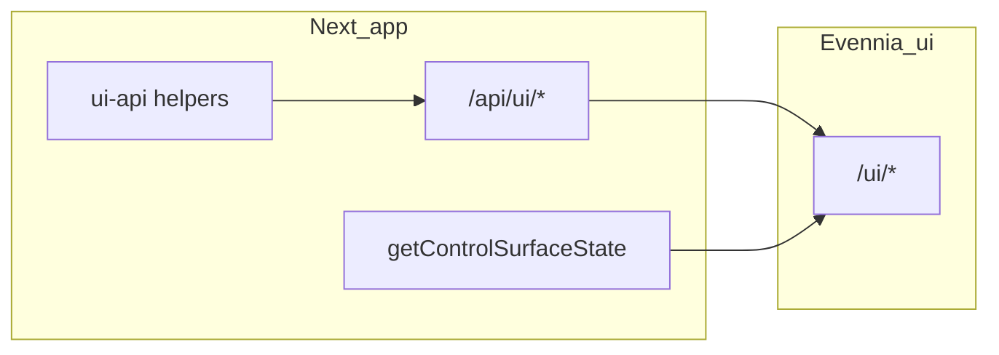

# Frontend/backend parity remediation

## Context

- UI traffic: Next `[frontend/aurnom/app/api/ui/[...path]/route.ts](frontend/aurnom/app/api/ui/[...path]/route.ts)` proxies to Evennia `[game/web/ui/urls.py](game/web/ui/urls.py)`.
- Primary player state: `[getControlSurfaceState](frontend/aurnom/lib/control-surface-api.ts)` → `[ControlSurfaceProvider](frontend/aurnom/components/control-surface-provider.tsx)`.
- Typed actions/read models: `[frontend/aurnom/lib/ui-api.ts](frontend/aurnom/lib/ui-api.ts)`.

## 1. Complete `ui-api.ts` for missing endpoints

Add types and functions (names can match existing style: `getX` / `postX`):

| Endpoint                    | Method | Notes                                                                                                                                                            |
| --------------------------- | ------ | ---------------------------------------------------------------------------------------------------------------------------------------------------------------- |
| `package/listings`          | GET    | Response shape: `{ listings: Array<{ packageId, key, estimatedValue, price, sellerKey, venueId? }> }` per `[get_package_listings](game/typeclasses/packages.py)` |
| `package/buy`               | POST   | Body `{ packageId }`; success returns `dashboard` like other purchase endpoints                                                                                  |
| `mine/claims`               | GET    | `{ ok, claims: [...] }` — listable unclaimed sites (`[mine_claims](game/web/ui/views.py)`)                                                                       |
| `property/resolve-incident` | POST   | Body `{ claimId, eventId }`; use `eventId` from incident preview `id` (`[_serialize_incident_for_web](game/typeclasses/property_player_ops.py)`)                 |

Staff-only observability (optional link; see section 6):

| `property/ops-health` | GET |
| `manufacturing/ops-health` | GET |

No client needed for `debug/msg-buffer` unless you want a dev-only debug page (explicitly gated by `DEBUG` on the server).

## 2. Mining package secondary market (list + browse + buy)

**Browse/buy**

- Add a focused client component (e.g. `components/package-listings-panel.tsx`) that loads `getPackageListingsState`, renders rows (seller, key, price, estimated value), and buys via `postPackageBuyListed` with success → `reload()` control surface (same pattern as `[claims-market-panel.tsx](frontend/aurnom/components/claims-market-panel.tsx)` using dashboard refresh).

**List from inventory**

- Wire existing `[packageListForSale](frontend/aurnom/lib/ui-api.ts)` from the dashboard: extend `[InventoryPanel](frontend/aurnom/components/control-surface-main-panels.tsx)` (or a small adjacent panel) so **mining packages** in `data.inventory` can open a minimal dialog (price input → POST `package/list`). On success, call `onReload()`.

**Placement**

- Add a new right-column panel id (e.g. `packageMarket`) in `[dashboard-right-column-ids.ts](frontend/aurnom/lib/dashboard-right-column-ids.ts)` and visibility in `[dashboard-right-column-visibility.ts](frontend/aurnom/lib/dashboard-right-column-visibility.ts)`: show when `data.inventory` contains mining packages **or** global listings are non-empty (requires either passing listing count from a child fetch or a lightweight GET on mount — prefer a single panel component that owns its listings fetch and shows empty state when none).

## 3. `mine/claims` in the claims UX

- In `[claims-market-panel.tsx](frontend/aurnom/components/claims-market-panel.tsx)` (or a child), optionally load `mine/claims` to show **listable unclaimed sites** distinct from the purchasable NPC list from `getClaimsMarketState`, if product-wise they differ (same file already uses `[getDashboardState](frontend/aurnom/lib/ui-api.ts)` for refresh).
- If the two APIs overlap heavily in practice, keep one section and document in code why both exist; still **expose the endpoint** so tooling and future UI are not blocked.

## 4. Control-surface `nav`: shops, kiosks, properties, mines

Today only `[data.nav.claims](frontend/aurnom/components/control-surface-main-panels.tsx)` renders (`ClaimsNavPanel`). `[persistent-nav-rail.tsx](frontend/aurnom/components/persistent-nav-rail.tsx)` only uses `roomExits`.

**Remediation**

- Add one right-column panel, e.g. `placesNav`, rendering:
  - **Shops**: `Link` to `href` from `data.nav.shops` (room query params as server already encodes).
  - **Kiosks**: `Link` + when `preNavigate` is set, use existing `[runKioskBeforeNavigate](frontend/aurnom/lib/ui-api.ts)` / `[isKioskPreNavigateKey](frontend/aurnom/lib/ui-api.ts)` (same contract as `[KioskPreNavigateKey](frontend/aurnom/lib/ui-api.ts)` comment block).
  - **Properties / mines**: links from `data.nav.properties` and `data.nav.resources` (or `mines` mirror).
- Visibility: panel visible if any of those arrays is non-empty (`[isRightColumnPanelVisible](frontend/aurnom/lib/dashboard-right-column-visibility.ts)`).
- Optionally duplicate a **compact** “Services” strip under the character block in the rail (same data) for discoverability without scrolling the right column — keep one source of truth (`data` prop) to avoid extra `/ui/nav` fetch.

## 5. Property incidents: resolve + types

- Add `postPropertyResolveIncident({ claimId, eventId })` in `ui-api.ts`.
- In `[app/(with-missions)/properties/[claimId]/page.tsx](frontend/aurnom/app/(with-missions)`/properties/[claimId]/page.tsx), replace raw `JSON.stringify` preview with structured rows: for each item in `eventQueuePreview` with `resolved === false` and a string `id`, show title/summary/due + **Resolve** → POST → refresh `getPropertyClaimDetail`.
- Extend TS types in `ui-api.ts` for incident preview (align fields from `[_serialize_incident_for_web](game/typeclasses/property_player_ops.py)`: `id`, `severity`, `title`, `summary`, `resolved`, etc.).

## 6. Staff engine health (`ops-health`)

- Backend and frontend gates differ today: staff reports use `account_may_manage_ingame_reports_web`; ops-health uses `is_staff` (`[property_ops_health](game/web/ui/views.py)`, `[manufacturing_ops_health](game/web/ui/views.py)`).
- **Recommended:** add a boolean on the control-surface JSON (e.g. `canStaffEngineHealthWeb`) in `[game/web/ui/control_surface.py](game/web/ui/control_surface.py)` derived from `request.user.is_staff`, mirror in `[ControlSurfaceState](frontend/aurnom/lib/control-surface-api.ts)`, and show a rail link only when true.
- New page e.g. `[app/(with-missions)/staff/ops-health/page.tsx](frontend/aurnom/app/(with-missions)`/staff/ops-health/page.tsx): parallel fetch both endpoints, render read-only cards; on 403 show the server message (no silent fallback).

## 7. Economy: mount world snapshot + reuse dead dashboard

- On `[app/economy/page.tsx](frontend/aurnom/app/economy/page.tsx)`, render `[EconomyWorldPanel](frontend/aurnom/components/economy-world-panel.tsx)` below existing cards (or merge into one section).
- Enhance `EconomyWorldPanel` to use the `**market`** array already returned by `[economy_world_state](game/web/ui/economy_world.py)` (typed in `[EconomyWorldPayload](frontend/aurnom/lib/ui-api.ts)`): compact table or reuse commodity row styling from `[commodity-ticker.tsx](frontend/aurnom/components/commodity-ticker.tsx)` patterns.
- Optionally poll `getEconomyWorldState` on an interval aligned with `[ui-refresh-policy](frontend/aurnom/lib/ui-refresh-policy.ts)` (or refresh on focus) — today the panel fetches once on mount.
- Wire `[EconomyDashboard](frontend/aurnom/components/economy-dashboard.tsx)` into the same `/economy` page (or fold its charts into `EconomyWorldPanel` if duplication is unwanted). Goal: **no exported dead feature component** unless intentionally kept for Storybook.

## 8. Dead `/ui/nav` path and unused shell

- `[site-shell.tsx](frontend/aurnom/components/site-shell.tsx)` and `[site-nav.tsx](frontend/aurnom/components/site-nav.tsx)` are only referenced by each other; `[getNavState](frontend/aurnom/lib/ui-api.ts)` is unused in mounted routes.
- **Remediation:** After section 4 ships, **delete** `site-shell.tsx` and `site-nav.tsx`, and remove `getNavState` from `ui-api.ts` (or keep a one-line comment pointing to `control-surface` + `placesNav` if you prefer not to delete the function yet). This removes duplicate nav polling and drift risk.

## 9. Verification

- Manual: package list → buy → inventory updates; list own package → appears in listings; property incident resolve; economy page shows world + market; dashboard shows places nav; staff ops page for staff user.
- Automated: add or extend a small test where practical — e.g. if the repo has UI API contract tests, add cases for new JSON shapes; otherwise rely on TypeScript strict typing for `ui-api` additions.

## Implementation order (suggested)

1. `ui-api.ts` wrappers + incident preview types (unblocks UI work).
2. Property resolve UI (isolated page change).
3. Package listings panel + inventory list action + panel registry IDs.
4. `placesNav` panel + optional rail strip; delete dead `site-nav` / `site-shell`.
5. Economy page: `EconomyWorldPanel` + market slice + `EconomyDashboard`.
6. Staff: `canStaffEngineHealthWeb` on control-surface + ops-health page.
7. `mine/claims` integration in claims market (last — depends on product clarity).

