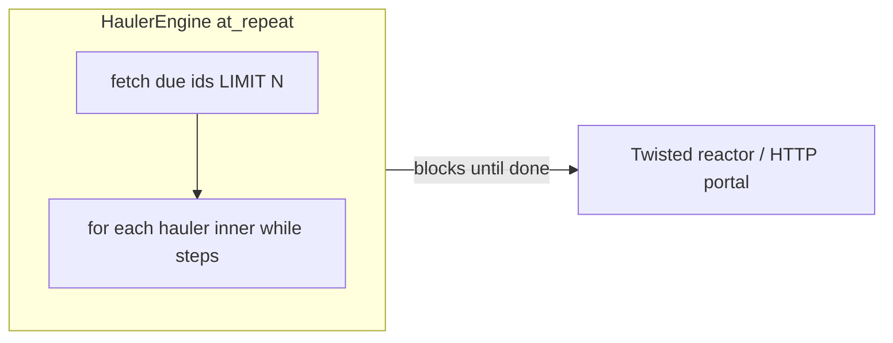

# Hauler engine performance + 12h mining cadence

## Problem (root cause)

`[HaulerEngine.at_repeat](game/typeclasses/haulers.py)` runs **synchronously on the main Evennia/Twisted thread**. Each tick it can:

- Fetch up to `**MAX_HAULERS_PER_ENGINE_TICK`** (default **400**) due rows from `[fetch_due_hauler_ids](game/world/hauler_dispatch.py)`.
- For **each** hauler, run up to `**HAULER_MAX_PIPELINE_STEPS`** (default **32**) calls to `**hauler_process_one`** in a tight `while` loop.

So one tick can perform **thousands** of object/DB-heavy steps before the reactor serves HTTP. That matches production evidence: `**wall_s=297`** with `**step(s)=360**`, plus portal timeouts and `slow_ui`.

Changing the mining grid to 12h **reduces how often** haulers align to boundaries but does **not** remove worst-case spikes (many due at once, catch-up after downtime, or many “due now” states). A **long-term** fix must **cap work per reactor turn**.

## 1) Wall-clock budget (primary scalability fix)

In `[HaulerEngine.at_repeat](game/typeclasses/haulers.py)` (same file as today’s `wall_s` logging):

- Add `**AURNOM_HAULER_ENGINE_MAX_WALL_SEC**` (env), default e.g. `**1.5**`–`**2.0**` seconds (tune after measurement).
- Inside the outer `for hid in due_ids:` loop, after each inner `while` iteration (or at least after each hauler finishes), check `time.perf_counter() - _tick_t0`. If over budget, **break** out of the outer loop and return.
- **Semantics:** remaining due haulers stay due; the next script fire (currently every `[HAULER_ENGINE_INTERVAL_SEC](game/world/time.py)`, overridable via existing `AURNOM_HAULER_ENGINE_INTERVAL_SEC`) continues the backlog. For a **12h** mining cycle, finishing a backlog over a few minutes is acceptable vs freezing the portal for **5 minutes**.
- Extend logging: e.g. `budget_hit=1 deferred_haulers≈K` (approximate from `len(due_ids) - processed_haulers`) and store `**ndb.last_tick_budget_hit`** for `[staff_hauler_engine_health](game/web/ui/views.py)` (expose `maxWallSec`, `lastBudgetHit`).

**Optional phase 2 (only if budget alone is insufficient):** schedule a `**reactor.callLater(0.05, ...)`** continuation when the budget trips, so backlog drains across **multiple reactor turns** within the same calendar second. More moving parts (re-entrancy, script stop/restart); defer unless needed.

## 2) Safer default caps (reduce worst case before budget trips)

In `[world/time.py](game/world/time.py)` / env defaults consumed by `[typeclasses/haulers.py](game/typeclasses/haulers.py)`:

- Lower `**MAX_HAULERS_PER_ENGINE_TICK`** default from **400** to something like **64–128** (still overrideable with existing `**AURNOM_MAX_HAULERS_PER_ENGINE_TICK`**).
- Lower `**HAULER_MAX_PIPELINE_STEPS**` default from **32** to something like **8–12** (overrideable with `**AURNOM_HAULER_MAX_PIPELINE_STEPS`**).

Rationale: a single hauler should not simulate many full round-trips in one reactor slice; spread work across ticks.

## 3) Mining delivery period = 12 hours (your requirement)

In `[game/world/time.py](game/world/time.py)`:

- Set `**MINING_DELIVERY_PERIOD = 12 * HOUR**` (replace `30 * MINUTE`), and refresh comments that still say “30m / 3h”.
- Add `**MINING_HAULER_PICKUP_OFFSET_SEC = 30 * MINUTE**` (your choice) as the **canonical** mining pickup delay after deposit.

In `[game/typeclasses/haulers.py](game/typeclasses/haulers.py)`:

- **Remove** `HAULER_PICKUP_OFFSET_SEC = MINING_DELIVERY_PERIOD // 2` (would incorrectly become **6 hours** at 12h period).
- Import and use `**MINING_HAULER_PICKUP_OFFSET_SEC`** for the mining branch of `_hauler_grid_params` (and re-export or alias so `[game/commands/haulers.py](game/commands/haulers.py)`, `[game/typeclasses/packages.py](game/typeclasses/packages.py)` keep working—either keep the name `HAULER_PICKUP_OFFSET_SEC` as an alias to the new constant for mining-only messaging, or update imports to `world.time` where appropriate).

Downstream **behavioral** consumers already keyed off `MINING_DELIVERY_PERIOD` (`[mining.py](game/typeclasses/mining.py)`, `[control_surface.py](game/web/ui/control_surface.py)`, `[economy_world.py](game/web/ui/economy_world.py)`, `[production_pipeline_estimate.py](game/world/production_pipeline_estimate.py)`, etc.) will automatically reflect the 12h grid once the constant changes.

## 4) HaulerEngine wake interval vs flora

`[HAULER_ENGINE_INTERVAL_SEC](game/world/time.py)` is documented as needing to be **≤** mining pickup offset and flora’s `**FLORA_HAULER_PICKUP_OFFSET_SEC` (15m)**. With **30m** mining pickup offset, `**5 * MINUTE`** remains valid. No change required unless you want fewer wakeups for CPU savings; then cap at **≤ 15m** for flora correctness.

## 5) Tests and observability

- Update `[game/world/tests/test_hauler_dynamic_schedule.py](game/world/tests/test_hauler_dynamic_schedule.py)` mocks that hard-code `(1800, 900)` to match new constants (or patch `world.time` values explicitly).
- Add a **focused test** for the engine: patch `fetch_due_hauler_ids` to return many ids and stub `hauler_process_one` to burn time; assert tick returns under `**max_wall`** and logs/flags budget hit (pattern similar to other script tests).
- Extend **staff JSON** in `[staff_hauler_engine_health](game/web/ui/views.py)` with `maxWallSec` and `lastBudgetHit` for operators.

## 6) Docker / ops (document only in compose comments unless you want defaults in repo)

Document in `[docker-compose.yml](docker-compose.yml)` (evennia service `environment`) the recommended knobs for production hosts, e.g.:

- `AURNOM_HAULER_ENGINE_MAX_WALL_SEC=2`
- `AURNOM_MAX_HAULERS_PER_ENGINE_TICK=96`
- `AURNOM_HAULER_MAX_PIPELINE_STEPS=10`

(No change to game logic required for these—they already exist except the new max-wall env.)

## 7) Data / migration note

Changing `**MINING_DELIVERY_PERIOD`** does **not** automatically rewrite every persisted `next_cycle_at` / dispatch row. After deploy, expect schedules to converge on **new boundaries** as code paths call `set_hauler_next_cycle` / mining schedulers; document any one-time staff/bootstrap expectation if you need a hard reset.

---

## Files to touch (summary)

| Area                 | Files                                                                                                                                                   |
| -------------------- | ------------------------------------------------------------------------------------------------------------------------------------------------------- |
| Cadence              | `[game/world/time.py](game/world/time.py)`, `[game/typeclasses/haulers.py](game/typeclasses/haulers.py)`, possibly import sites for pickup constant     |
| Engine budget + logs | `[game/typeclasses/haulers.py](game/typeclasses/haulers.py)`                                                                                            |
| Staff visibility     | `[game/web/ui/views.py](game/web/ui/views.py)`                                                                                                          |
| Tests                | `[game/world/tests/test_hauler_dynamic_schedule.py](game/world/tests/test_hauler_dynamic_schedule.py)`, new test module or extend existing hauler tests |
| Ops hints            | `[docker-compose.yml](docker-compose.yml)` comments or env lines                                                                                        |

