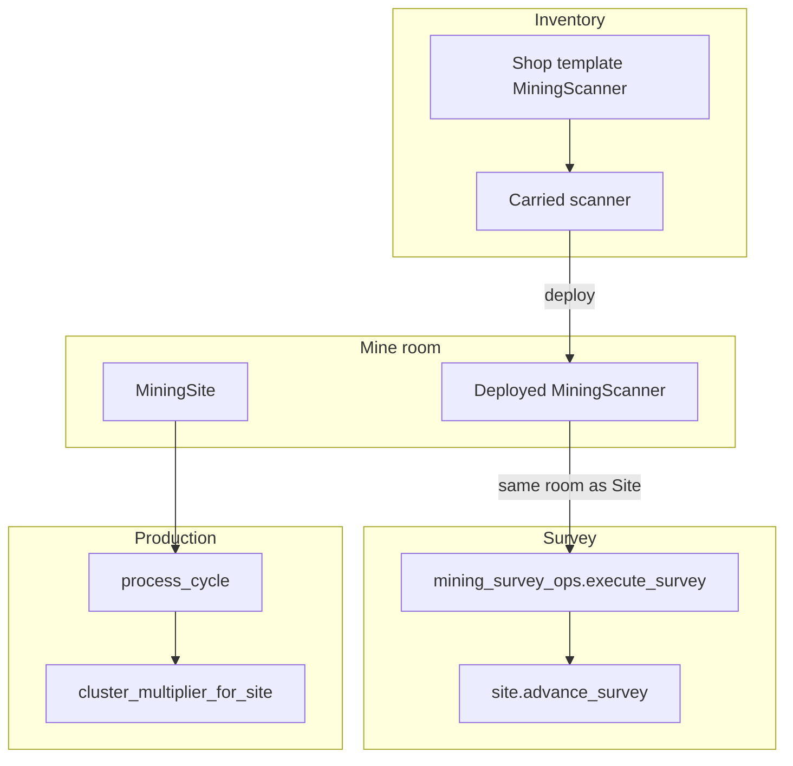

# Mining Scanner, survey gate, districts, camps/bases

## Architecture (data flow)

## 1. District key on every mining site

- Add `[game/world/mining_districts.py](game/world/mining_districts.py)`: `assign_district_key(venue_id: str, site_id: int) -> str` using a **fixed pool per venue** and `site_id % len(pool)` (survives restarts; no in-memory cycle).
- In `[game/typeclasses/claim_utils.py](game/typeclasses/claim_utils.py)` `generate_mining_site`, after `create_object` returns `site`, set `site.db.mining_district_key = assign_district_key(venue_id, site.id)`.
- **Migration (one-time)**: script or `@py` loop over `search_tag("mining_site", category="mining")`: if `mining_district_key` missing, set using `venue_id_for_object(site)` and `site.id` (import from `[world/venue_resolve.py](game/world/venue_resolve.py)`).

## 2. `MiningScanner` typeclass + shop SKU

- New `[game/typeclasses/mining_scanner.py](game/typeclasses/mining_scanner.py)`: `DefaultObject` + `ObjectParent`; `at_object_creation`: `db.owner`, `db.is_deployed`, `db.deploy_site_ref`; tags `mining_scanner` (`category="mining"`) + `tool` (`category="inventory"`); methods `deploy_at_site(character, site)` / `undeploy_to_inventory(character)` (move to room vs character, toggle locks `get:false()` when deployed).
- `[game/world/bootstrap_shops.py](game/world/bootstrap_shops.py)`: add `CATALOG` row `"Mining Scanner - Basic Stationary"`, `mining-outfitters`, description, **fixed** `MINING_SCANNER_PRICE_CR` constant, bucket `tool`.
- Extend `_ensure_catalog_template` (same file): if template key is the scanner SKU, `create_object("typeclasses.mining_scanner.MiningScanner", ...)` instead of `typeclasses.objects.Object`, then apply existing vendor/tag/economy/`catalog_id` logic if you keep product catalog alignment (optional: add `prod.*` row later; not required for this feature).

## 3. Deploy / undeploy commands

- New commands module (e.g. `[game/commands/mining_scanner.py](game/commands/mining_scanner.py)`) or append to `[game/commands/mining.py](game/commands/mining.py)`:
  - `**deployminingscanner <name fragment>`**: caller in room with exactly one `MiningSite` in `room.contents` (reuse resolution pattern from `[handle_survey](game/world/web_interactions.py)`); scanner in `caller.contents`; **allow** unclaimed sites or sites owned by caller (`not site.db.is_claimed` or `site.db.owner == caller`); call `scanner.deploy_at_site(caller, site)`.
  - `**undeplyminingscanner <fragment>`** (or `pickupminingscanner`): reverse; only owner.
- Register in `[game/commands/default_cmdsets.py](game/commands/default_cmdsets.py)`.

## 4. Survey: single entry point + scanner gate + shared cooldown

- New `[game/world/mining_survey_ops.py](game/world/mining_survey_ops.py)`:
  - `resolve_mining_site_in_room(room)` — first `mining_site` tag in `room.contents` (same as today).
  - `room_has_deployed_scanner(room, character, site)` — exists `MiningScanner` in `room.contents` with `db.is_deployed`, `db.owner == character`, `db.deploy_site_ref == site`.
  - `execute_survey(character)` → raises `SurveyError` or returns dialogue tuple compatible with `InteractionLine`:
    - If no room / no site: error.
    - If not `room_has_deployed_scanner`: error message stating deployed scanner required.
    - Cooldown: use existing key `survey_scan` / `3.0`s — if not ready, error with time left (same UX as `[CmdSurvey](game/commands/mining.py)`).
    - Call `site.advance_survey()`; build dialogue string **identical in structure** to current `[handle_survey](game/world/web_interactions.py)` (levels 1–3 messaging using `SURVEY_LEVELS`).
    - On success: `character.cooldowns.add("survey_scan", 3.0)`.
- Refactor `[game/world/web_interactions.py](game/world/web_interactions.py)` `handle_survey` to call `execute_survey` and map to `InteractionLine` / `InteractionError` (so `[play_interact](game/web/ui/views.py)` and telnet stay aligned).
- Refactor `[game/commands/mining.py](game/commands/mining.py)` `CmdSurvey`: remove duplicate cooldown/survey body; call `execute_survey`; keep mission sync and `WEB_STREAM_OPTIONS_KEY` options **after** success exactly as today.

## 5. District probe (information only)

- New `[game/world/mining_district_survey.py](game/world/mining_district_survey.py)`: `list_district_peers(character, site)` — `search_tag("mining_site", category="mining")`, filter `site.db.mining_district_key`, same `venue_id_for_object`, include row if **unclaimed** OR `db.owner == character`; return safe fields: `siteKey`, `roomKey`, `isClaimed`, `surveyLevel` (no full composition leak beyond what claim market already exposes for unclaimed).
- Command `**districtscan`** (or `probescan`): requires deployed scanner for **current** site (same check as survey); optional cooldown `district_scan` (e.g. 30s); pretty-print list.

## 6. Camp / Base registry and production multipliers

- New `[game/world/mining_clusters.py](game/world/mining_clusters.py)`: pure functions:
  - `probe_complete(site) -> bool`: `int(site.db.survey_level or 0) >= 3`.
  - `try_form_camp(owner, site_ids: list[int])` / `try_form_base(owner, camp_cluster_ids: list[str])` — validate counts (6 / 4), single owner, same `mining_district_key` + `venue_id_for_object`, all `probe_complete`, sites not already in a cluster; write `site.db.cluster_id` (e.g. `camp:<uuid>` / `base:<uuid>`).
  - `cluster_multiplier_for_site(site) -> float`: **1.21** if cluster kind base, **1.1** if camp only, else **1.0** (base supersedes camp; no stacking Camp+Base).
- New global script `[game/typeclasses/mining_cluster_registry.py](game/typeclasses/mining_cluster_registry.py)` (or `world/` + thin Script): `persistent=True`, `db.clusters: dict` holding camp/base records (owner id, district_key, venue_id, member site ids or camp ids). Register in `[game/server/conf/settings.py](game/server/conf/settings.py)` `GLOBAL_SCRIPTS` as `mining_cluster_registry` (follow comment: entry = `typeclass` + `persistent` only).
- Commands `**formminingcamp`** / `**formminingbase**` calling `try_*` and updating registry + site `db.cluster_id`.
- `[game/typeclasses/mining.py](game/typeclasses/mining.py)` `process_cycle`: after `point_mult`, multiply `total_tons` by `cluster_multiplier_for_site(self)` (import from `world.mining_clusters`).

## 7. Web / API

- No new endpoint required for survey if `[play_interact](game/web/ui/views.py)` with `interactionKey: "survey"` remains the web path; `**handle_survey` refactor automatically applies scanner gate + cooldown** to web.
- Optional: add `surveyLevel` / `miningDistrictKey` to `[_serialize_mining_site](game/web/ui/views.py)` if the client should show district without a separate call (small additive field).

## 8. Tests

- `[game/world/tests/test_mining_scanner_survey.py](game/world/tests/test_mining_scanner_survey.py)`: survey fails without scanner; succeeds with deployed scanner; cooldown enforced via `execute_survey`.
- `[game/world/tests/test_mining_districts.py](game/world/tests/test_mining_districts.py)`: `generate_mining_site` sets `mining_district_key`.
- `[game/world/tests/test_mining_clusters.py](game/world/tests/test_mining_clusters.py)`: camp 6 sites → multiplier 1.1 on `process_cycle` tonnage (fixed deposit/rig fixture); base 4 camps → 1.21.

## 9. Rollout order

1. `mining_districts` + `generate_mining_site` + migration.
2. `MiningScanner` + bootstrap + deploy commands.
3. `mining_survey_ops` + `handle_survey` + `CmdSurvey`.
4. `mining_district_survey` + `districtscan`.
5. Registry script + `GLOBAL_SCRIPTS` + `mining_clusters` + form commands + `process_cycle` hook.
6. Tests.

## Risk / behavior note

- **Breaking change**: `survey` / web survey will **no longer work** without a deployed scanner at the site; document in help strings and any player-facing changelog.

