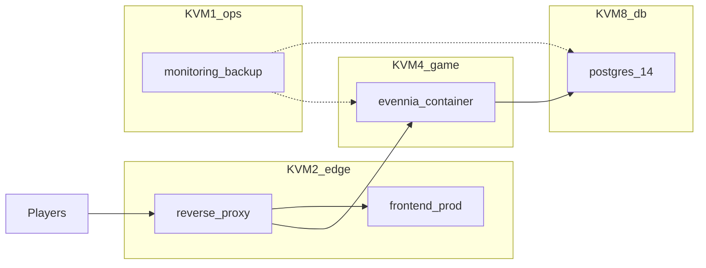

# Multi-host Docker deployment plan

## Isolation: dedicated deploy folder (no mingling)

All **production** Docker assets for the four KVM hosts live in **one dedicated directory at the repo root**, separate from application code:

- **Suggested path:** `deploy/kvm/` (or `infrastructure/kvm/` if you prefer that name).
- **Inside it only:** `docker-compose.yml` (or host-named files) per role, reverse-proxy config snippets/Caddyfile, `.env.example` templates, backup scripts invoked by compose, and `deploy/kvm/README.md`.
- **Explicitly not** in that tree: Python game modules, Next pages, or dev-only hacks. The root `docker-compose.yml` remains **local all-in-one dev** and is untouched by production rollout (optional later rename to `docker-compose.dev.yml` is separate).

This keeps `game/`, `frontend/`, and root dev compose **free of production stack noise** and makes reviews obvious: anything under `deploy/kvm/` is infra-only.

## Deploy separately from this local machine / dev repo

**Goal:** Production VPSes do **not** rely on a developer laptop checkout or bind-mounting the full monorepo like today’s dev compose.

**Recommended workflow:**

1. **CI** (GitHub Actions, etc.) checks out the **full repo** only in the pipeline: builds the Evennia image from the repo-root `Dockerfile` and the frontend production image (Dockerfile under `deploy/kvm/edge/` or `frontend/aurnom` context as defined in that stack), then **pushes versioned tags** to a registry (GHCR, Docker Hub, etc.).
2. **Each VPS** holds **only** what it needs:
  - Copy or `git clone` **either** the `deploy/kvm/` subtree **or** a **small sibling repository** (e.g. `aurnom-deploy`) that mirrors that folder—so secrets and compose live off the main dev tree if you want stricter access control.
  - Compose files on the server use `image: registry/...:tag` for `evennia` and `frontend`, not `build: ../../` from a full game checkout on the box.
3. **Optional:** Maintain a **second git repo** that contains only `deploy/kvm/` content; sync from monorepo via subtree/submodule or CI publish. That repo is what operators clone on servers—**zero** game source on disk unless someone explicitly pulls for debugging.

**Migrations:** run one-off from a container using the **same** Evennia image tag as production: `docker compose run --rm evennia evennia migrate --noinput`, with `POSTGRES_HOST` pointing at KVM 8—still orchestrated from `deploy/kvm/evennia/`, not from ad-hoc laptop paths.

## Current state (reference)

- Root `docker-compose.yml`: **dev** — evennia + postgres + `npm run dev` frontend.
- `game/server/conf/docker_settings.py`: PostgreSQL when `POSTGRES_HOST` is set.

## Target topology




- **KVM 8**: only the database container(s). Postgres must **not** publish `5432` to the public internet; bind to private IP or Docker network reachable only from KVM 4 (and KVM 1 for backups if desired).
- **KVM 4**: only Evennia. Set `POSTGRES_HOST` to the **private hostname/IP** of KVM 8. Publish `4000/4001/4002` to **private** interface only (or localhost + proxy on KVM 2), not `0.0.0.0` on the public WAN.
- **KVM 2**: reverse proxy (TLS, rate limits, WebSockets) + **production** Next.js (not dev). Proxy forwards game web and API to KVM 4’s portal/web ports; serves static or SSR from the frontend container.
- **KVM 1**: no game and no primary DB; small compose for observability, optional backup runner, bastion/VPN is often **host-level** (not always Docker).

---

## 1. KVM 8 — Database host

**Location:** `deploy/kvm/postgres/`

**Compose role:** `postgres` only (`postgres:14-alpine` for parity with dev).

**Deliverable:**

- `docker-compose.yml` + named volume (e.g. `postgres_data`) on NVMe path.
- `healthcheck` (`pg_isready`) matching current dev compose.
- `.env.example` for `POSTGRES_DB`, `POSTGRES_USER`, `POSTGRES_PASSWORD` (real secrets via `.env` on server, not committed).
- Optional: `postgres-exporter` sidecar; Postgres tuning via mounted `conf.d/`.

---

## 2. KVM 4 — Game host (Evennia)

**Location:** `deploy/kvm/evennia/`

**Compose role:** `evennia` only — **image from registry** (built in CI from repo root `Dockerfile` with `INSTALL_POSTGRES=true`).

**Deliverable:**

- `docker-compose.yml`: **no** `depends_on: postgres`; `POSTGRES_HOST=<KVM8_private>`.
- **No** bind mounts of `./evennia` or `.:/usr/src/game` on production.
- Ports `4000/4001/4002`; firewall allows KVM 2 (+ admin).
- Healthcheck: socket to `4001` (same idea as root compose).

**Migrations:** `docker compose run --rm evennia evennia migrate --noinput` from this directory when DB is up.

---

## 3. KVM 2 — Edge + frontend

**Location:** `deploy/kvm/edge/`

**Compose role:** reverse proxy + production frontend.

**Deliverable:**

- `docker-compose.yml` + `Caddyfile` or `nginx.conf` under this folder.
- Multi-stage **frontend** build: either a `Dockerfile` in `deploy/kvm/edge/` that `COPY`s from build context (CI passes context from monorepo) **or** compose `image:` only if CI builds and pushes `aurnom-web`.
- `EVENNIA_BASE_URL` pointing at KVM 4 internal URL.
- Replace dev `npm run dev` entirely for this stack.

---

## 4. KVM 1 — Ops host

**Location:** `deploy/kvm/ops/`

**Compose role:** monitoring and/or backup helpers; **no** Postgres primary, **no** Evennia.

**Deliverable:**

- `docker-compose.yml`: node-exporter, optional Prometheus/Grafana or Uptime Kuma; backup job using `postgres:14-alpine` client targeting KVM 8, dumps to object storage.
- Alternative: host `cron` + `docker run --rm` documented in `deploy/kvm/README.md`.

---

## Cross-cutting: networking and secrets


| Concern                | Approach                                                                                        |
| ---------------------- | ----------------------------------------------------------------------------------------------- |
| DB reachability        | KVM 4 `POSTGRES_HOST` → KVM 8 private IP; `pg_hba.conf` allows only KVM 4 (+ KVM 1 for backup). |
| Game API from frontend | Internal URL to KVM 4 from KVM 2 containers; browsers use public domain → proxy only.           |
| Secrets                | `.env` / Compose secrets on each host; never commit.                                            |
| Images                 | CI builds from full repo; servers only pull images + `deploy/kvm/`.                             |


---

## Folder layout (target)

```text
deploy/kvm/
  README.md                 # runbook, order of startup, what goes on which host
  postgres/
    docker-compose.yml
    .env.example
  evennia/
    docker-compose.yml
    .env.example
  edge/
    docker-compose.yml
    Caddyfile               # or nginx/
    Dockerfile.frontend     # optional if build context wired in CI
    .env.example
  ops/
    docker-compose.yml
    .env.example
```

---

## Deployment order (runbook)

1. KVM 8: from `deploy/kvm/postgres/` — Postgres up, health OK, no public `5432`.
2. KVM 4: from `deploy/kvm/evennia/` — migrate, then Evennia up.
3. KVM 2: from `deploy/kvm/edge/` — proxy + frontend up, TLS + WebSocket paths verified.
4. KVM 1: from `deploy/kvm/ops/` — monitoring/backup.

**Application code changes:** none required for the split; **infra-only** additions under `deploy/kvm/` plus CI pipeline definition (if stored in repo, e.g. `.github/workflows/`—that can live outside `deploy/kvm/` or include a workflow that only references `deploy/kvm` paths).