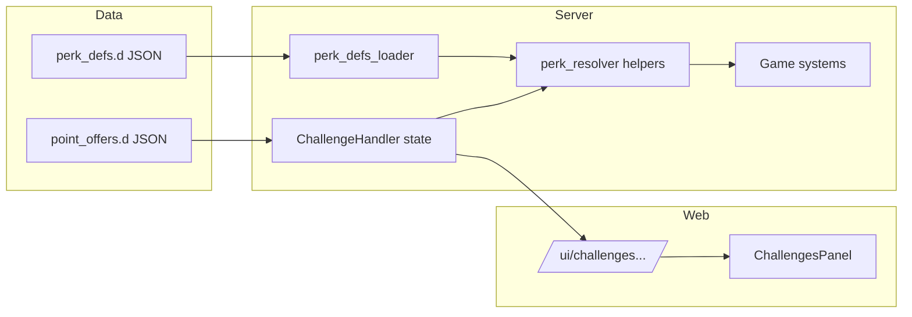

# Perk mechanics + full Challenges dashboard UI

## Goals

- Implement the **15 perk effects** as **server-only numeric fields** in `[game/world/data/perk_defs.d/](game/world/data/perk_defs.d/)` (plus `[game/world/point_store/perk_defs_loader.py](game/world/point_store/perk_defs_loader.py)`), aggregated in `[game/world/point_store/perk_resolver.py](game/world/point_store/perk_resolver.py)` using the **same product rule** as `miningOutputMult` (multiply equipped perks’ values; missing defs skipped; invalid values fail loud at load or at read—match existing `miningOutputMult` behavior).
- Wire each stat into **one authoritative call site** per row in the prior mapping (mining cycle, refining collect/sale, missions, challenges rewards, refinery batch output, rig repair, property incidents, license command).
- Add **dashboard UI** inside the existing **Challenges** control-surface panel: slot summary, **sortable equipped row**, **owned bench** with equip/unequip, and **no raw multipliers** in JSON (only `title` / `summary` from defs for display—consistent with opaque perks).
- Add **POST** loadout endpoint + **owned perk list + perk catalog slice** in `[serialize_for_web](game/world/challenges/challenge_handler.py)`.

## Architecture

## 1) Perk definition schema

**Extend** `[_normalize_perk_row](game/world/point_store/perk_defs_loader.py)` to accept:

- **Display (web-safe):** `title`, `summary` (strings; required for new perks, optional for legacy `smoke_yield_pin` with fallback to `id`).
- **Mechanics (defaults `1.0` where “no change”):**  
`miningOutputMult`, `processingFeeMult`, `rawSaleFeeMult`, `extractionTaxMult`, `miningDepletionMult`, `hazardRaidStealMult`, `hazardGeoFloorMult`, `rigWearGainMult`, `missionCreditsMult`, `challengePointsMult`, `challengeCreditsMult`, `refiningBatchOutputMult`, `rigRepairCostMult`, `propertyIncidentBonusMult`, `miningLicenseFeeMult`.

**Validation:** reject non-positive or absurd values at **loader** time (clear error string) so bad JSON never ships silently.

## 2) Resolver helpers

In `[perk_resolver.py](game/world/point_store/perk_resolver.py)`, add one function per stat, each **product over equipped ids** (mirror `mining_output_multiplier`). Keep `aggregate_modifiers()` updated for tests/logging.

**Semantics (document in module docstring):**

- **Fee/tax/cost mults:** interpret as multiplier on the **charged** amount or rate (e.g. `processingFeeMult=0.95` → effective fee 95% of base). Clamp effective rates to `[0, 1]` where they represent percentages of gross, after perk product, to avoid exploits.
- `**miningDepletionMult`:** scale `dep_rate` down (e.g. product × rate).
- `**hazardGeoFloorMult`:** blend geological floor upward toward 1.0 (e.g. `min_geo + (1-min_geo) * (1-product)` with product in `[0,1]`—pick one formula and stick to it).
- **NPC-owned mining sites:** apply only perks where the **owner** is a player character (same guard pattern as existing `point_mult` block in `[mining.py](game/typeclasses/mining.py)`).

## 3) Game hooks (call sites)

| Stat                                           | File(s) to touch                                                                                                                                                                                                                                  |
| ---------------------------------------------- | ------------------------------------------------------------------------------------------------------------------------------------------------------------------------------------------------------------------------------------------------- |
| `miningOutputMult`                             | Already in `[game/typeclasses/mining.py](game/typeclasses/mining.py)`                                                                                                                                                                             |
| `processingFeeMult`                            | `[game/commands/refining.py](game/commands/refining.py)`, `[game/world/refinery_web_ops.py](game/world/refinery_web_ops.py)`, any auto-collect path using `PROCESSING_FEE_RATE` in `[game/typeclasses/refining.py](game/typeclasses/refining.py)` |
| `rawSaleFeeMult`                               | `[split_raw_sale_payout](game/typeclasses/refining.py)` or callers so **seller**’s net reflects perks                                                                                                                                             |
| `extractionTaxMult`                            | Mining cycle tax block in `[game/typeclasses/mining.py](game/typeclasses/mining.py)` (~947+)                                                                                                                                                      |
| `miningDepletionMult`                          | Richness update in same cycle                                                                                                                                                                                                                     |
| `hazardRaidStealMult` / `hazardGeoFloorMult`   | Hazard branches in `[game/typeclasses/mining.py](game/typeclasses/mining.py)`                                                                                                                                                                     |
| `rigWearGainMult`                              | Wear increment in mining cycle                                                                                                                                                                                                                    |
| `missionCreditsMult`                           | `[MissionHandler._apply_rewards](game/typeclasses/missions.py)`                                                                                                                                                                                   |
| `challengePointsMult` / `challengeCreditsMult` | `[ChallengeHandler._apply_rewards_for_entry](game/world/challenges/challenge_handler.py)`                                                                                                                                                         |
| `refiningBatchOutputMult`                      | `[Refinery.process_recipe](game/typeclasses/refining.py)` and portable `[PortableProcessor.process_recipe](game/typeclasses/processors.py)` on produced units                                                                                     |
| `rigRepairCostMult`                            | `[compute_rig_repair_charge](game/typeclasses/mining.py)` or `pay_rig_repair`                                                                                                                                                                     |
| `propertyIncidentBonusMult`                    | `[_apply_spawn_bonus](game/typeclasses/property_events_engine.py)`                                                                                                                                                                                |
| `miningLicenseFeeMult`                         | License cost in `[game/commands/mining.py](game/commands/mining.py)`                                                                                                                                                                              |

Each hook: resolve `character` (mission/challenge owner, refinery collector, mining site owner, etc.), call `perk_resolver.<helper>(character)`.

## 4) Catalog data + point offers

- Add **15 rows** to `[game/world/data/perk_defs.d/](game/world/data/perk_defs.d/)` (new file e.g. `progression.json`) with ids matching the earlier names (`yield_pin`, `plant_auditor`, …), titles, summaries, and tuned numbers.
- Add **matching `grant_perk` offers** in `[game/world/data/point_offers.d/](game/world/data/point_offers.d/)` (costs/prereqs TBD—use a linear or tiered tree; at least one **extra slot** offer like existing smoke).
- Ensure `[grant_perk](game/world/point_store/effects.py)` still validates ids against defs.

## 5) Challenge handler: loadout + serialization

Add methods on `[ChallengeHandler](game/world/challenges/challenge_handler.py)`:

- `owned_perk_ids()` reader.
- `set_equipped_perks(ordered_ids: list[str]) -> tuple[bool, str]`: validate **subset of owned**, **no duplicates**, **len ≤ perk_slot_total**, persist via `_save()`.

Extend `[serialize_for_web](game/world/challenges/challenge_handler.py)`:

- `ownedPerks: string[]`
- `perkCatalog: { id, title, summary }[]` — union of **owned** ids (and optionally equipped) resolved through `get_perk_def`; **omit** numeric fields.

Fix **empty panel** logic in `[challenges-panel.tsx](frontend/aurnom/components/challenges-panel.tsx)`: if `ownedPerks.length > 0` or `pointOffers.length > 0`, do **not** show the global “no challenges” empty state (today it ignores owned perks).

## 6) Web API

- Register `path("challenges/perk-loadout", ...)` in `[game/web/ui/urls.py](game/web/ui/urls.py)`.
- Implement `challenges_perk_loadout` in `[game/web/ui/views.py](game/web/ui/views.py)`: POST body `{ "equippedPerkIds": string[] }`, auth + character resolution (same as `[challenges_purchase](game/web/ui/views.py)`), optional short rate-limit key, call `set_equipped_perks`, return `{ ok, message?, challenges: serialize_for_web() }`.

## 7) Frontend dashboard UI

- Types: extend `[ChallengesState](frontend/aurnom/lib/ui-api.ts)` with `ownedPerks`, `perkCatalog` (new small type).
- Client: `setChallengePerkLoadout({ equippedPerkIds })` in `[ui-api.ts](frontend/aurnom/lib/ui-api.ts)` mirroring `purchaseChallengeOffer`.
- UI: new `**PerkLoadoutBlock`** in `[challenges-panel.tsx](frontend/aurnom/components/challenges-panel.tsx)` (collapsible via `useDashboardPanelOpen`, cyan section styling like `PointStoreBlock`):
  - Header: `Slots equipped / perkSlotTotal`.
  - **Equipped:** `@dnd-kit/sortable` horizontal or vertical list (project already depends on it); on drag end POST new order.
  - **Bench:** owned perks not in equipped — “Equip” moves into first free slot (client computes next state, POST).
  - Unequip removes from equipped list (POST).
- Wire through `[control-surface-main-panels.tsx](frontend/aurnom/components/control-surface-main-panels.tsx)`: pass a new callback `onSetPerkLoadout` alongside purchase (pattern match `purchaseChallengeOffer` / refresh).

## 8) Tests

- **Loader:** extend or add tests for new fields and validation errors in `[game/world/tests/](game/world/tests/)` (near existing point store tests).
- **Loadout:** `set_equipped_perks` validation (unknown id, too many slots, duplicate).
- **Resolver:** one test per helper or table-driven product test with fake equipped list / mock `get_perk_def`.
- **Integration smoke:** 1–2 hooks (e.g. processing fee + mission credits) with a test character with equipped perks.

## Delivery order (recommended)

1. Schema + resolver + `set_equipped_perks` + API + UI (players can rearrange; mining still works).
2. Add all `perk_defs` + offers.
3. Land game hooks in batches (mining/refining/missions/challenges first—highest traffic).

## Risks / notes

- **Balance:** fee/tax mults need clamping so effective rates stay in valid ranges.
- **Double counting:** avoid applying both a fee mult and a separate “payout mult” on the same transaction; this plan uses **distinct** levers only.
- **Opaque policy:** do not add numeric bonuses to `serialize_for_web`; titles/summaries come from JSON copy.

