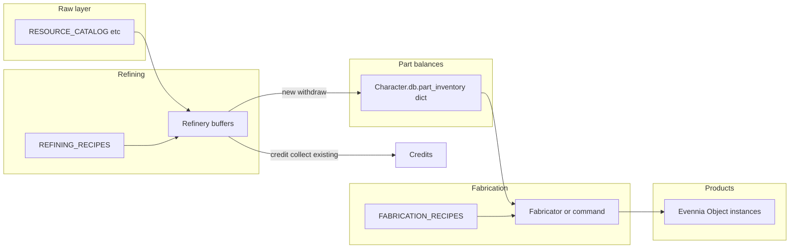

# Product catalog and fabrication platform

## Current facts (constraints)

- Raw resources: `[RESOURCE_CATALOG](game/typeclasses/mining.py)` plus flora/fauna catalogs; refining accepts those keys as **tons** in `[Refinery.feed](game/typeclasses/refining.py)` / queues.
- Refined outputs: `[REFINING_RECIPES](game/typeclasses/refining.py)` keys (e.g. `refined_iron`) with **units** in `db.output_inventory` / per-owner `miner_output`. Web collection **always pays credits** via `[collect_attributed_refined](game/world/refinery_web_ops.py)` and `[Refinery.collect_miner_output](game/typeclasses/refining.py)`—no carried “part” objects today.
- Buy path: `[_ensure_catalog_template](game/world/bootstrap_shops.py)` builds templates with `db.economy`, `db.is_template=True`, and **one** `category="inventory"` tag (e.g. `tool`). `[CmdBuy](game/commands/shop.py)` does `template.copy()`, clears template flags, sets `db.owner`.
- Web inventory: `[serialize_inventory_by_bucket](game/world/inventory_taxonomy.py)` + `[_dashboard_inventory_item_for_obj](game/web/ui/views.py)`; unclassified carried objects are **omitted** with a log warning.

## Target architecture

**Prescriptive choices (aligned with prior approval + Evennia):**

1. **Catalog source of truth**: New module(s) under `[game/world/](game/world/)` (e.g. `product_catalog.py` or a small `product_catalog/` package) holding plain dicts / dataclasses loaded at import time—same pattern as `REFINING_RECIPES` and bootstrap `CATALOG` tuples.
2. **IDs**: Reuse existing **refining output keys** as **part IDs** (`refined_iron`, …) to avoid a second naming system. **Product IDs** are new stable strings (e.g. `prod.supply_multitool`); **raw** remains the existing resource keys in mining/flora/fauna catalogs.
3. **Parts are not default physical objects**: Store fabricatable part **units** on the puppet as `Character.db.part_inventory: dict[str, float]` (keys = part IDs). This scales without hundreds of `Object`s and matches existing refinery **dict** semantics. Optional later: stackable “part token” objects tagged `part` if you want physical loot drops.
4. **Products are Evennia objects**: Spawn with `db.catalog_id`, `db.owner`, locks, and inventory tags taken from the product row (same as today’s templates).
5. **Refining stays behaviorally stable**: Keep `REFINING_RECIPES` and `Refinery.process_recipe` as the execution engine for raw→part **in buffers**. First implementation adds **withdraw to `part_inventory`** as an alternative to **credit payout**, not a replacement.

## Implementation phases

### Phase 1 — Catalog schema + validation (no gameplay change)

Add `**PART_DEFINITIONS`**: for each key in `REFINING_RECIPES`, define `{name, desc, category, base_value_cr}`—initially **mechanically mirrored** from existing recipe fields (single source can be a small builder function that asserts parity so you do not drift).

Add `**PRODUCT_DEFINITIONS`**: `{catalog_id, display_key, desc, typeclass_path, inventory_bucket_tag, economy.base_price_cr, optional flags}`.

Add `**FABRICATION_RECIPES**`: `{recipe_id: {inputs: {part_id: units_per_batch}, output_catalog_id, output_units_per_batch}}`. Start with **zero or one** recipe for the vertical slice.

Add `**world/product_catalog_validate.py`** (or tests-only module) called from a **unit test** that asserts:

- Every `FABRICATION_RECIPES` input key exists in `REFINING_RECIPES` (part IDs).
- Every `FABRICATION_RECIPES` output exists in `PRODUCT_DEFINITIONS`.
- Every `PRODUCT_DEFINITIONS.inventory_bucket_tag` is covered by `[INVENTORY_RULES](game/world/inventory_taxonomy.py)` (or extend rules before adding new tags).
- No duplicate `catalog_id`s.

### Phase 2 — `db.catalog_id` and spawn helper

- Add `**spawn_product_instance(catalog_id, owner, location=None)`** in `world/` (e.g. `product_spawn.py`): resolves `PRODUCT_DEFINITIONS`, `create_object` or `copy` from a designated template if you prefer prototypes—**prescriptive**: use `**create_object(typeclass_path, key=display_key, location=owner)`** for new catalog-driven items to avoid duplicating template objects per SKU; set `db.catalog_id`, `db.desc`, `db.economy`, apply `tags.add(bucket_tag, category="inventory")`, locks `get;drop;give` like `[CmdBuy](game/commands/shop.py)`.
- Update `[_ensure_catalog_template](game/world/bootstrap_shops.py)` (or successor) to set `**db.catalog_id**` on templates for products that exist in `PRODUCT_DEFINITIONS`, and make `**CmdBuy**` after `copy` ensure `**db.catalog_id**` is copied from template (or re-resolve from template key mapping).
- Extend `[_dashboard_inventory_item_for_obj](game/web/ui/views.py)` to include `**catalogId**` when `db.catalog_id` is set (frontend can ignore until used).

### Phase 3 — Part inventory bridge from refinery

- Add **pure functions** e.g. `add_part_units(char, part_id, units)` / `consume_part_units(char, part_id, units)` with rounding policy **matching refinery** (2 decimal places for units where applicable).
- Add **server path** that moves units from `**ref.miner_output[owner]`** (and/or portable processor `db.output_inventory` if in scope) into `**char.db.part_inventory**` without credit payout—mirror the **restore** pattern in `[collect_attributed_refined](game/world/refinery_web_ops.py)` for transactional safety (snapshot → mutate → rollback on failure).
- Add **in-game command** (e.g. `withdrawrefined` / `partsclaim`) and **optional** web POST under `[game/web/ui/urls.py](game/web/ui/urls.py)` next to refinery routes, reusing `[resolve_refinery_web_context](game/world/refinery_web_ops.py)` patterns.
- **Do not** change default `**collect-refined`** behavior.

### Phase 4 — Fabricator execution (minimal vertical slice)

- Add `**Fabricator` typeclass** (e.g. `[game/typeclasses/fabricator.py](game/typeclasses/fabricator.py)`) **or** start with a **command** `fabricate <recipe>` in-room at a tagged station object—**prescriptive**: typeclass with `db.location` in refinery/services room, methods `can_fabricate(operator, recipe_id)`, `fabricate(operator, recipe_id, batches=1)` that consume `operator.db.part_inventory` and call `spawn_product_instance`.
- Register command in `[game/commands/default_cmdsets.py](game/commands/default_cmdsets.py)`.
- Add **tests**: recipe consumes correct units; insufficient parts fails loudly; spawn sets `catalog_id` and correct inventory tag.

### Phase 5 — UI read model (optional but consistent)

- Mirror `[refinery_read_model.py](game/web/ui/refinery_read_model.py)`: e.g. `fabricator_state` JSON listing available recipes (filtered by gates if you add them later), `part_inventory` snapshot, and cooldowns if added later.

## Files likely touched (concrete)

| Area                | Files                                                                                                                                                                                                                                               |
| ------------------- | --------------------------------------------------------------------------------------------------------------------------------------------------------------------------------------------------------------------------------------------------- |
| New catalog + spawn | `[game/world/product_catalog.py](game/world/product_catalog.py)` (or package), `[game/world/product_spawn.py](game/world/product_spawn.py)`                                                                                                         |
| Validation tests    | `[game/world/tests/test_product_catalog.py](game/world/tests/test_product_catalog.py)`                                                                                                                                                              |
| Refinery withdraw   | `[game/world/refinery_web_ops.py](game/world/refinery_web_ops.py)`, `[game/commands/refining.py](game/commands/refining.py)` (or new command module), `[game/web/ui/views.py](game/web/ui/views.py)` + `[game/web/ui/urls.py](game/web/ui/urls.py)` |
| Fabrication         | `[game/typeclasses/fabricator.py](game/typeclasses/fabricator.py)`, `[game/commands/…](game/commands/)`                                                                                                                                             |
| Shops / templates   | `[game/world/bootstrap_shops.py](game/world/bootstrap_shops.py)`, `[game/commands/shop.py](game/commands/shop.py)`                                                                                                                                  |
| Inventory payload   | `[game/web/ui/views.py](game/web/ui/views.py)` (`_dashboard_inventory_item_for_obj`); optionally `[control_surface.py](game/web/ui/control_surface.py)` if duplicated                                                                               |
| Taxonomy            | `[game/world/inventory_taxonomy.py](game/world/inventory_taxonomy.py)` only if new bucket tags                                                                                                                                                      |

## Rollout / risk notes

- **Economy**: Withdrawing parts instead of credits **bypasses** treasury processing-fee payout; document as intentional (you are taking **goods** not **cash**). Optionally apply a **flat parts-withdrawal fee** later—out of scope unless you specify.
- **PortableProcessor**: Same withdraw logic can be shared if you pass `(buffer_dict, mutate_callback)` abstraction; can be Phase 4b.
- **Frontend**: Server can ship `catalogId` and a future `parts` object in `dashboard_state` without blocking Phase 1–4.

## Success criteria

- Tests enforce catalog consistency.
- At least **one** `FABRICATION_RECIPES` entry produces a real carried product with `db.catalog_id` and correct inventory bucket.
- Existing **refined credit collection** unchanged and covered by existing tests; new tests cover withdraw + fabricate paths.

