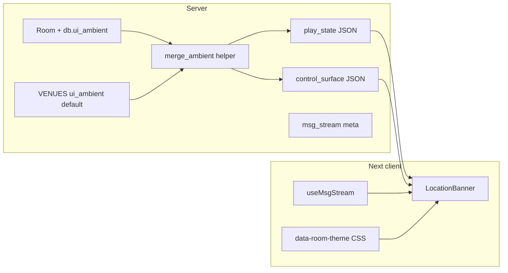

# Phased plan: room-aware chrome, banner, and billboards

## Context (current behavior)

- `[game/web/ui/views.py](game/web/ui/views.py)` `_serialize_room` returns only `roomName`, `roomDescription`, `storyLines`, `exits`, `actions` — no presentation metadata.
- Venues already exist: `[game/world/venues.py](game/world/venues.py)` and `room.db.venue_id` via `[apply_venue_metadata](game/world/venues.py)`; resolution via `[venue_id_for_object](game/world/venues.py)`.
- Dashboard shell has `[ControlSurfaceProvider](frontend/aurnom/components/control-surface-provider.tsx)` with `data.character.room` (`[CsCharacter](frontend/aurnom/lib/control-surface-api.ts)`).
- Web lines land in `Character.web_msg_buffer` with `meta` dict (`[record_web_stream_text](game/typeclasses/characters.py)`); the frontend **[strips unknown meta keys](frontend/aurnom/lib/use-msg-stream.ts)** today — billboard fields must be added explicitly to the TS type and normalizer.

---

## Phase 1 — Contract and serialization (backend only)

**Goal:** Stable JSON shape for “what this place looks/sounds like” in the API, without UI yet.

1. **Define a small schema** (document in a short comment next to the helper; avoid a heavy schema lib unless you already use one):
  - `themeId` (string, e.g. `promenade`, `industrial`, `clinical`, `bazaar`)
  - `label` / `tagline` (optional display strings; can default to venue `label` + room key)
  - `bannerSlides[]`: `{ id, title?, body?, graphicKey? }` (start with 1–3 slides; `graphicKey` maps to client-side SVG/registry only)
  - `marqueeLines[]`: short strings for a ticker
  - `chips[]`: `{ id, text }` for small status badges (e.g. “OPEN”, hazard tier later)
2. **Implement `resolve_room_ambient(room) -> dict`** in a dedicated module (e.g. `[game/world/room_ambient.py](game/world/room_ambient.py)`) to keep `[views.py](game/web/ui/views.py)` lean:
  - Load `venue_id = getattr(room.db, "venue_id", None)` or `venue_id_for_object(room)` as fallback if you want rooms without `db.venue_id` to still inherit.
  - Base dict from `get_venue(vid).get("ui_ambient")` (new optional key on venue entries — start empty `{}` for all venues, then seed one venue as proof).
  - Deep-merge or field-override with `room.db.ui_ambient` if present (JSON dict). Document merge rule: **room overrides win per top-level key** (simplest).
3. **Expose on APIs:**
  - Append `venueId` and `ambient` to `_serialize_room` / `play_state` response in `[views.py](game/web/ui/views.py)`.
  - Append the same `ambient` (and `venueId` if not already present) to `[control_surface.py](game/web/ui/control_surface.py)` for the authenticated character’s **current** `char.location` so the dashboard can render chrome without an extra `/ui/play` fetch.
4. **Types:** Extend `[PlayState](frontend/aurnom/lib/ui-api.ts)` and `[ControlSurfaceState](frontend/aurnom/lib/control-surface-api.ts)` with optional `venueId` + `ambient` (mirror Python keys exactly).
5. **Tests:** One focused test that creates or uses a room with `db.ui_ambient` and asserts `play_state` (or the serializer helper) returns merged JSON; optionally assert control-surface includes ambient when puppet has a location.

---

## Phase 2 — `LocationBanner` + theme variables (Play + dashboard strip)

**Goal:** Visible differentiation on first load; no rotation/stream yet.

1. **CSS:** In `[frontend/aurnom/app/globals.css](frontend/aurnom/app/globals.css)` (or a co-located layer), define **default** `:root` / `.dark` variables (accent, banner background, border) and **scoped overrides** for `[data-room-theme="industrial"]` etc. Match existing cyber-cyan / zinc language from `[site-shell.tsx](frontend/aurnom/components/site-shell.tsx)`.
2. **Component:** New `LocationBanner` (client component) that:
  - Accepts `ambient` + `roomName` (fallback when ambient missing: single-line title using `roomName`).
  - Sets `data-room-theme={ambient.themeId}` on a wrapper **or** on `document.documentElement` only if you accept global theme shift (prefer **local wrapper** under main content to avoid fighting the rest of the app).
3. **Integration points:**
  - `[frontend/aurnom/app/play/page.tsx](frontend/aurnom/app/play/page.tsx)`: render banner **below** `[CsHeader](frontend/aurnom/components/cs-page-primitives.tsx)` (or replace subtitle area with banner for less duplication).
  - `[control-surface-main-panels.tsx](frontend/aurnom/components/control-surface-main-panels.tsx)` or `[persistent-nav-rail.tsx](frontend/aurnom/components/persistent-nav-rail.tsx)`: thin **strip** above columns using `data.ambient` when present (compact variant).
4. **Accessibility:** Ensure banner text is real text (not only images); sufficient contrast for each `themeId`.

---

## Phase 3 — Rotation, marquee, graphics, reduced motion

**Goal:** “Rotating graphics” and ticker without heavy assets.

1. **Slides:** Crossfade between `bannerSlides` every N seconds (`useEffect` + state); if only one slide, no timer.
2. `**prefers-reduced-motion`:** If set, show **first slide only** and **static marquee** (first line or non-scrolling block).
3. `**graphicKey`:** Small registry map `Record<string, ReactNode>` of inline SVG silhouettes (refinery, promenade, asteroid, etc.); unknown keys render nothing. Keeps payload small and avoids CDN dependency in v1.
4. **Marquee:** CSS animation or duplicate-text strip; cap speed and pause on hover for readability.

---

## Phase 4 — Ephemeral billboard via msg-stream

**Goal:** System pulses (price spike, travel, station notices) flash in the banner area without duplicating the full game log.

1. **Meta convention (Python):** Extend `[DEFAULT_WEB_STREAM_META](game/world/web_stream.py)` documentation and defaults with optional keys, e.g. `billboardHeadline`, `billboardSeverity` (`info` | `warn` | `alert`), `billboardTtlSec` (default 45), `billboardRoomKey` (optional; if omitted, assume “current room at emit time” is already implied by player — use `**destinationRoomKey`** when the message is about a place, or add one explicit key to avoid overloading). **Simplest rule:** show in banner if `billboardHeadline` is set **and** (`billboardRoomKey` is null OR equals player’s current room from control surface / play).
2. **Emitters:** At least one real call site — e.g. augment existing `[play_travel](game/web/ui/views.py)` `char.msg(..., options={WEB_STREAM_OPTIONS_KEY: ...})` to include `billboardHeadline` so you can verify end-to-end.
3. **Frontend:**
  - Extend `[MsgStreamEntry](frontend/aurnom/lib/ui-api.ts)` `meta` and `[normalizeMsgStreamEntry](frontend/aurnom/lib/use-msg-stream.ts)` to **preserve** the new keys (today they are dropped).
  - Add `useBillboardFeed(currentRoomKey)` (or fold into a small hook used by `LocationBanner`) that listens to `useMsgStream` messages, filters by room + headline, pushes into a **ring buffer** with expiry by `ts + ttl`.
4. **UI:** Banner shows a dismissible or auto-fading row for active billboard items (severity maps to border/accent class).

---

## Phase 5 — Content seeding and venue defaults

**Goal:** Players feel the difference in real hubs, not only in test rooms.

1. Add `ui_ambient` blocks to **2 venues** in `[VENUES](game/world/venues.py)` (e.g. core promenade vs industrial plant tone).
2. Set `db.ui_ambient` on a **few landmark rooms** (mining outfitters, bank branch room if distinct, processing plant) via bootstrap or a one-off management command — whichever matches how you already tune world data.
3. Optionally derive **one marquee line** from existing world signals (e.g. append next mining cycle ISO from play payload) in `resolve_room_ambient` for mine-adjacent rooms — keep logic minimal.

---

## Phase 6 — Stretch / backlog (from earlier analysis)

Implement only after the above is stable:

- **Archetype signature widgets:** Generalize the `[MINING_OUTFITTERS_ROOM](frontend/aurnom/app/play/page.tsx)` special-case into `ambient.layoutHints` (`rightColumn: "commodity_board" | "default"`) so new room types don’t require new `if (roomName === ...)` branches.
- **Dynamic chips:** hazard tier, shift name, “maintenance window” from scripts.
- **Time-of-day / shift** copy variants if you have a canonical world clock helper.
- **Faction / reputation** one-liners in banner when those systems expose a simple read.

---

## Risk and scope control

- **Do not** put large binary assets in Evennia attributes; keep `graphicKey` + client SVG registry until you need real art.
- **Merge semantics:** document clearly so builders know whether to duplicate full `ambient` on a room or only override `themeId`.
- **Play vs dashboard:** keep `resolve_room_ambient` as the **single** Python entry point used by both `play_state` and `control_surface` to avoid drift.

