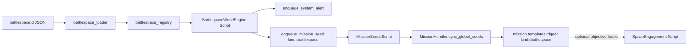

# Starship dogfight / battlespace implementation plan

## Goals and vocabulary

- **Pillar behavior**: Ongoing **battlespace pressure** (sorties, pickets, intercept geometry, distress SKWAKs) feeds **system alerts** and **mission seeds**, like crime feeds story—see `[game/typeclasses/crime_world_engine.py](game/typeclasses/crime_world_engine.py)`.
- **Tone**: Mix **spaceflight** terms (burn, closure, emcon, lock, thermal) with **fleet ops** labels (CAP, task unit, CIC picture) in template copy only; code identifiers stay neutral (`battlespace`, `engagement`).

## Architecture (data flow)




## Phase 1 — Battlespace world feed (crime parallel)

**New files (mirror crime stack):**


| Purpose                                              | Pattern reference                                                                                                  |
| ---------------------------------------------------- | ------------------------------------------------------------------------------------------------------------------ |
| Process-local registry + lock                        | `[game/world/crime_registry.py](game/world/crime_registry.py)` → `battlespace_registry.py`                         |
| JSON validate + `replace_`* + cadence buckets        | `[game/world/crime_loader.py](game/world/crime_loader.py)` → `battlespace_loader.py`                               |
| Coverage log: template ids vs mission `seedIdsAny`   | `[game/world/crime_mission_coverage.py](game/world/crime_mission_coverage.py)` → `battlespace_mission_coverage.py` |
| `create_script` if missing                           | `[game/world/bootstrap_crime.py](game/world/bootstrap_crime.py)` → `bootstrap_battlespace.py`                      |
| Interval Script: pick template, dedupe, alert + seed | `[game/typeclasses/crime_world_engine.py](game/typeclasses/crime_world_engine.py)` → `battlespace_world_engine.py` |


**Seed contract** (match crime’s shape for consistency):

```python
enqueue_mission_seed(
    kind="battlespace",
    seed_id=chosen["id"],
    source_key=dedupe_key,  # e.g. "battlespace:{id}:{slot}"
    title=chosen["title"],
    summary=chosen["summary"],
    payload={"severity", "category", "cadence", ...},
    ttl_seconds=max(3600, int(chosen.get("cooldown_seconds") or 3600)),
)
```

**JSON schema**: Reuse crime row validation shape where possible: `id`, `cadence` (`tick`|`strong`), `weight`, `cooldown_seconds`, `severity`, `category`, `title`, `summary`, optional `broadcast`, `min_tick`, `source`. Store chunks under `[game/world/data/battlespace.d/](game/world/data/battlespace.d/)` with optional legacy file `battlespace_templates.json`; use `[game/world/json_bulk_loader.py](game/world/json_bulk_loader.py)` `discover_chunk_paths` like `[crime_loader.crime_source_paths](game/world/crime_loader.py)`.

**Startup wiring:**

- `**at_server_start`** (`[game/server/conf/at_server_startstop.py](game/server/conf/at_server_startstop.py)`): after crime (or beside it), call `bootstrap_battlespace_registry_at_startup`, `log_battlespace_mission_coverage`, same as ambient/crime pattern in `at_server_start` (~lines 33–51).
- `**at_server_cold_start**` (same file ~242–316): add `bootstrap_battlespace_world` next to `bootstrap_crime_world`.

**Admin reload command:** Clone `[game/commands/crime.py](game/commands/crime.py)` `CmdReloadCrime` → e.g. `CmdReloadBattlespace` in `commands/battlespace.py` (or `reload_space_ops.py`), register in `[game/commands/default_cmdsets.py](game/commands/default_cmdsets.py)`.

## Phase 2 — Missions hookup

**Mission triggers** today only allow `alert|incident|room|interaction|crime` (`[game/world/mission_loader.py](game/world/mission_loader.py)` `_ALLOW_TRIGGER_KINDS` ~line 16). Extend with:

- `battlespace` (or `space_ops`—pick one and use everywhere).

`matching_templates_for_seed` already matches `trig.get("kind") == seed_kind` and `seedId in seedIdsAny`—no logic change beyond the allowlist.

**MissionHandler source dedupe:** Seeds with `kind` that should dedupe by `sourceKey` use `_should_mark_source_seen` (`[game/typeclasses/missions.py](game/typeclasses/missions.py)` ~77–79). Add `battlespace` alongside `crime` / `alert` if you want one opportunity per dedupe key.

**Content:** Add `[game/world/data/missions.d/](game/world/data/missions.d/)` file e.g. `80_battlespace.json` with 1–2 templates:

- `trigger`: `{ "kind": "battlespace", "seedIdsAny": ["..."] }` aligned with JSON template **ids** from battlespace.d.
- `missionKind`: e.g. `"space"` or `"story"`—whatever you standardize for UI filters (crime uses `"crime"` in `[70_crime.json](game/world/data/missions.d/70_crime.json)`).

**Coverage:** Call `log_battlespace_mission_coverage()` after loaders in startup so typos in `seedIdsAny` appear in logs immediately (mirror `[crime_mission_coverage.py](game/world/crime_mission_coverage.py)`).

## Phase 3 — Tactical engagement (dogfight core)

**Holder:** Prefer a **persistent `Script`** keyed e.g. `space_engagement_{uuid}` or one Script per fight with `db.engagement_id`—matches how other engines use `[game/typeclasses/scripts.py](game/typeclasses/scripts.py)` `Script` base (see `CrimeWorldEngine` inheritance). Alternative: dedicated `Object` in a staff-only room if you need in-world debugging; Script is enough for MVP.

**State model (`db.state` dict)** — keep versioned:

- `schema_version`, `tick`, `closed` (bool).
- **Geometry**: `range_band` (enum int or string: `merge|knife|medium|standoff`), `closing` (`in|out|neutral`), `aspect` (`advantage|neutral|disadvantage`) — abstracted so tick rate does not require true orbital math.
- **Actors**: list of `{role, character_id?, vehicle_id?, side, hull_pct, shield_pct, heat, emcon, lock_quality, tube_timers, ai_policy_id}`.
- **RNG audit**: `seed` (int), `log` (short ring buffer of `{tick, action, roll}`) for staff fairness.

**Stats source:** Participant ships use `[game/typeclasses/vehicles.py](game/typeclasses/vehicles.py)` `db.combat` (populated from catalog `build_combat` in `[game/world/bootstrap_vehicle_catalog.py](game/world/bootstrap_vehicle_catalog.py)`: agility, sensors, stealth, armor, shields, hp, hardpoints, etc.). Resolver functions read **dict snapshots** (not ORM objects) so NPC “phantom ships” can be plain dicts.

**Tick Script:**

- `interval`: 3–5 seconds (tune for telnet + web latency).
- `at_repeat`: advance missiles/cooldowns/lock decay; run AI stub for NPC sides; apply damage via pure functions; `msg` all `Character` participants; optionally attach structured `options={"space_engagement": snapshot}` for the web client (same path as `Character.msg` / web stream patterns).

**Pure resolver module** (suggested location): `game/world/space_combat_resolve.py` with functions like `apply_maneuver(state, actor_id, maneuver)`, `resolve_attack(state, weapon_profile)`, returning `{state_new, events}`. Keep **no** Evennia imports inside resolver for easy unit tests.

**Commands:** New `game/commands/space_combat.py`:

- Player: `engage` / `disengage` (start or leave—enforce single active engagement per pilot if desired), `burn`, `coldcoat`, `fox`, `breaklock` (aliases tuned to your fiction).
- Implementation: load Script by id stored on `character.db.active_space_engagement_id` (or search Script by participant list).
- Optional: **merge `EngagementCmdSet`** onto character when `active_space_engagement_id` is set (cleaner than a long default cmdset); or keep commands global with guards.

**Entry points from missions:**

- Mission objective completes via existing kinds first: e.g. `visit_room` + `choice` after “return to dock.”
- **Phase 3b:** Add objective kind `engagement` (or `interaction`-like with `interactionKeysAny` emitted by resolver events) in `[mission_loader.py](game/world/mission_loader.py)` `_ALLOW_OBJECTIVE_KINDS` and implement `_progress_engagement` in `[MissionHandler](game/typeclasses/missions.py)` called from the engagement tick when `events` contains e.g. `"objective:won"` / `mission_tag` in payload.

## Phase 4 — Challenges and cross-pillar hooks

- From engagement events, call into `[Character.challenges](game/typeclasses/characters.py)` if a challenge template keys off “under fire” or subsystem strain—same pattern as other progression hooks.
- Optional: push crime-relevant events (piracy, false IFF) into `[CrimeRecordHandler](game/typeclasses/characters.py)` when outcome warrants.

## Testing and ops

- **Unit tests:** Resolver in `world/space_combat_resolve.py` with fixed RNG seed.
- **Integration:** Cold start on dev DB; confirm `search_script("battlespace_world_engine")` exists; confirm seeds appear in `mission_seeds` and opportunities after `sync_global_seeds` (player login or explicit call from missions command if already invoked).
- **Balance:** Start with one friendly + one hostile profile; scale AI policies later.

## File checklist (concise)


| Area               | Files                                                                                                        |
| ------------------ | ------------------------------------------------------------------------------------------------------------ |
| Registry + load    | `world/battlespace_registry.py`, `world/battlespace_loader.py`, `world/data/battlespace.d/*.json`            |
| Engine + bootstrap | `typeclasses/battlespace_world_engine.py`, `world/bootstrap_battlespace.py`                                  |
| Missions           | Extend `world/mission_loader.py`, `typeclasses/missions.py`; add `world/data/missions.d/80_battlespace.json` |
| Coverage           | `world/battlespace_mission_coverage.py`                                                                      |
| Server             | `server/conf/at_server_startstop.py`                                                                         |
| Admin              | `commands/...` + `default_cmdsets.py`                                                                        |
| Combat             | `world/space_combat_resolve.py`, `typeclasses/space_engagement.py` (Script), `commands/space_combat.py`      |


## Design constraints (explicit)

- Cap concurrent ticking engagements; distant fights stay **seeds + narrative** only.
- Prefer **abstract bands** over continuous 6-DOF simulation until you need more fidelity.
- Log **dedupe keys and RNG seed** on the engagement for PvP disputes.

