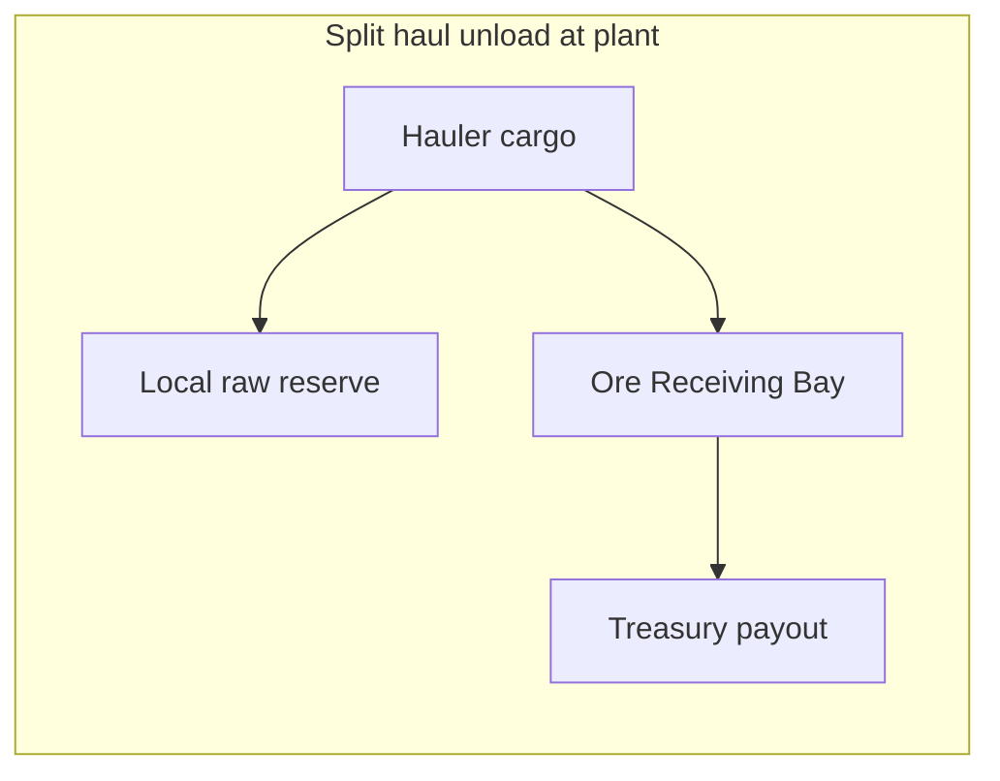

# Phase plan: tiered split-haul Resource Colonies (10 / 25 / 75 / 100 %)

## Context (current codebase)

- **Industrial Resource Colony** (`[game/world/bootstrap_npc_industrial_miners.py](game/world/bootstrap_npc_industrial_miners.py)`): NPCs deliver to the **Ore Receiving Bay** (no `haul_local_reserve_then_plant`).
- **Hybrid Buffer Colony** (`[game/world/bootstrap_npc_hybrid_buffer_colony.py](game/world/bootstrap_npc_hybrid_buffer_colony.py)`): same `mining_pro` deploy as industrial, but sets `haul_delivers_to_local_raw_storage`, `haul_destination_room` (core plant), `haul_local_reserve_then_plant`; sites tagged `npc_hybrid_buffer_supply`.
- **Flora/fauna** for Hybrid Buffer: `[game/world/bootstrap_npc_resource_colony_bio.py](game/world/bootstrap_npc_resource_colony_bio.py)` `_bootstrap_bio_hybrid_buffer_colony_grid()` uses `[HYBRID_BUFFER_RESOURCE_BIO](game/world/hybrid_colony_constants.py)` + `[NPC_HYBRID_BUFFER_UNITS](game/world/hybrid_colony_constants.py)`, reapplies haul attrs, then `_bootstrap_flora_track` / `_bootstrap_fauna_track`.
- **Unload math**: `[_haul_unload_split_local_then_plant](game/typeclasses/haulers.py)` uses `HAUL_LOCAL_PLANT_FILL_FRACTION` (0.5) today; treasury “payment” applies only to the **bay** portion.

**Your choice:** keep **Hybrid Buffer** and **add** four new colonies (five split-style grids total on the hub).

---

## Phase 1 — Engine: allowlisted per-owner fill fraction

**Goal:** Default **50%** when `db.haul_local_plant_fill_fraction` is unset (Hybrid Buffer + any future split user). New colonies set **only** `{0.1, 0.25, 0.75, 1.0}` on their NPCs.

**Files:**

- `[game/typeclasses/haulers.py](game/typeclasses/haulers.py)`
  - Add `ALLOWED_HAUL_LOCAL_PLANT_FILL_FRACTIONS = frozenset({0.1, 0.25, 0.5, 0.75, 1.0})` (include `0.5` so explicit storage is valid if ever needed).
  - Add `effective_haul_local_plant_fill_fraction(owner)` — `None` → `HAUL_LOCAL_PLANT_FILL_FRACTION`; else parse float, match allowlist with small epsilon, on invalid value `logger.log_err` and fall back to default (per repo “loud but non-bricking” boundary).
  - In `_haul_unload_split_local_then_plant`, replace `cap_tgt * HAUL_LOCAL_PLANT_FILL_FRACTION` with `cap_tgt * effective_haul_local_plant_fill_fraction(owner)`.
  - Extend module docstring to document `db.haul_local_plant_fill_fraction`.
- `[game/typeclasses/packages.py](game/typeclasses/packages.py)` (deploy/reactivate `dest_note` for split buyers): derive display percent from `effective_haul_local_plant_fill_fraction(buyer)` instead of hard-coded `50%`.

**Tests:** Extend `[game/world/tests/test_hauler_split_unload.py](game/world/tests/test_hauler_split_unload.py)` with parameterized cases for `0.1, 0.25, 0.5, 0.75, 1.0` (same 100 t cap / 60 t cargo fixture); assert bay settlement **not** called when remainder to bay is 0.

---

## Phase 2 — Data: four colony specs (names, keys, tags, units)

**Goal:** Four **parallel** worlds of objects, no key collisions with Hybrid Buffer or Industrial.

**New module (recommended):** `[game/world/tiered_split_colony_constants.py](game/world/tiered_split_colony_constants.py)` (name adjustable) containing:

- For each tier `10 | 25 | 75 | 100`:
  - `local_plant_fill_fraction` (0.1, 0.25, 0.75, 1.0).
  - **Unique** `staging_room_key`, staging desc, hub exit keys/aliases (distinct from `[Hybrid Buffer](game/world/bootstrap_npc_hybrid_buffer_colony.py)` and `[Industrial](game/world/bootstrap_npc_industrial_miners.py)`).
  - **Unique** `site_tag` + `site_tag_category` (`world`) for idempotent mining deploy (same pattern as `npc_hybrid_buffer_supply`).
  - **Unique** `RESOURCE_BIO` dict — structurally clone `[HYBRID_BUFFER_RESOURCE_BIO](game/world/hybrid_colony_constants.py)`: `colony_label`, flora/fauna annex room keys/descs, exit keys/aliases, pad prefixes, cell desc templates, `flora_deploy_tag` / `fauna_deploy_tag` (must be **unique** per colony so bio bootstrap idempotency tags do not clash).
  - **Five NPC rows** (mirror `NPC_HYBRID_BUFFER_UNITS`): `unit_id`, `npc_key`, `npc_desc`, `deploy_profile: "mining_pro"`. Names must be globally unique (search/create uses `npc_key`).

**Do not** change `[NPC_HYBRID_BUFFER_UNITS](game/world/hybrid_colony_constants.py)` or existing Hybrid bootstrap in this phase beyond any shared helper imports.

---

## Phase 3 — Mining bootstrap: parameterized split colony runner

**Goal:** One implementation; Hybrid Buffer remains a thin caller with its legacy spec.

**Refactor target:** `[game/world/bootstrap_npc_hybrid_buffer_colony.py](game/world/bootstrap_npc_hybrid_buffer_colony.py)` **or** new `[game/world/bootstrap_npc_split_buffer_colony.py](game/world/bootstrap_npc_split_buffer_colony.py)` that exports:

- `apply_split_buffer_colony_haul_attrs(owner, local_plant_fill_fraction: float | None)`  
  - Sets the same three flags as today’s `apply_hybrid_buffer_colony_haul_attrs`.  
  - If `local_plant_fill_fraction is not None`, set `owner.db.haul_local_plant_fill_fraction` to that value (must be in allowlist; **raise** at bootstrap if constants are wrong).  
  - If `None`, **clear** or omit `haul_local_plant_fill_fraction` so `effective_haul_local_plant_fill_fraction` returns **50%** (Hybrid Buffer).
- `bootstrap_split_buffer_colony(spec)` — generalize current loop: staging/cells/sites/deploy/tag/reapply attrs + `sync_hybrid_buffer_hauler_destinations`-equivalent renamed to `sync_split_buffer_hauler_destinations(owner)` (same logic, generic name).
- `bootstrap_npc_hybrid_buffer_colony()` becomes: `bootstrap_split_buffer_colony(HYBRID_BUFFER_LEGACY_SPEC)` with `local_plant_fill_fraction=None` for all units.
- Add `bootstrap_npc_tiered_split_colonies()` (or four one-liners) that iterates the four specs from Phase 2 and calls `bootstrap_split_buffer_colony` with the tier fraction.

**Log prefixes:** e.g. `[npc-tiered-split:10]` per colony for grep-friendly ops.

---

## Phase 4 — Flora/fauna bio: loop tiered specs

**Goal:** Same starter bio as Hybrid (even composition deposits, same plant key lists copied from `HYBRID_BUFFER_RESOURCE_BIO`), different rooms/tags/NPC owners.

**File:** `[game/world/bootstrap_npc_resource_colony_bio.py](game/world/bootstrap_npc_resource_colony_bio.py)`

- Extract the body of `_bootstrap_bio_hybrid_buffer_colony_grid` into `_bootstrap_bio_split_buffer_colony_grid(spec, log_prefix, apply_haul_fn)` where `apply_haul_fn(owner)` sets haul attrs + fraction for that colony.
- Keep `_bootstrap_bio_hybrid_buffer_colony_grid()` as a call into the helper with Hybrid constants.
- Add `_bootstrap_bio_tiered_split_colonies()` that iterates the four Phase-2 specs: `_owners_for_units` → for each owner `apply_split_buffer_colony_haul_attrs(owner, spec.fraction)` + `sync_split_buffer_hauler_destinations` → flora + fauna tracks.

**Venue JSON:** No change required unless you later want these colonies mirrored on `frontier_outpost` (out of scope unless you add it later).

---

## Phase 5 — Startup wiring and ordering

**File:** `[game/server/conf/at_server_startstop.py](game/server/conf/at_server_startstop.py)` (`at_server_cold_start`)

- After `bootstrap_npc_hybrid_buffer_colony` (or replace with ordering: industrial → **hybrid** → **tiered split colonies** → resource colony bio), add `_run_strict("Tiered split Resource Colonies (10/25/75/100%)", bootstrap_npc_tiered_split_colonies)` **before** `bootstrap_npc_resource_colony_bio` so mining sites and NPCs exist before flora/fauna deploy (same invariant as today).

Order should remain:

1. Hauler/refinery/bootstrap that creates receiving bay.
2. Hybrid mining bootstrap.
3. **New** tiered mining bootstraps.
4. `bootstrap_npc_resource_colony_bio` (includes hybrid + tiered bio).

---

## Phase 6 — Hygiene, docs, and ops

- Update any player/admin copy that still says “50% only” for split haul where it should reflect `effective_haul_local_plant_fill_fraction`.
- **World size:** four full Hybrid clones ⇒ **20 new Characters**, **80 new pad rooms + sites**, **8 annex rooms**, **32 flora + 32 fauna cells** (same scale as Hybrid × 4). Document for deploy/DB expectations.
- Optional management command later: bulk repoint haulers (pattern exists in `[repoint_npc_haulers_to_core_plant](game/world/management/commands/repoint_npc_haulers_to_core_plant.py)`) if staging keys change during iteration — not required if keys are stable on first ship.

---

## Phase 7 — Verification

- Run `evennia test` for `[game/world/tests/test_hauler_split_unload.py](game/world/tests/test_hauler_split_unload.py)` and any bio deploy tests if present.
- Cold start smoke: four colonies log “Bootstrap complete”, no duplicate-key errors, flora/fauna tracks print success for each `log_prefix`.

---

## Summary table

| Colony set               | `haul_local_plant_fill_fraction` | Mining / flora / fauna template                    |
| ------------------------ | -------------------------------- | -------------------------------------------------- |
| Hybrid Buffer (existing) | unset → **50%**                  | Current Hybrid constants                           |
| New ×4                   | **0.1 / 0.25 / 0.75 / 1.0**      | Clone of Hybrid `RESOURCE_BIO` + `mining_pro` pads |

