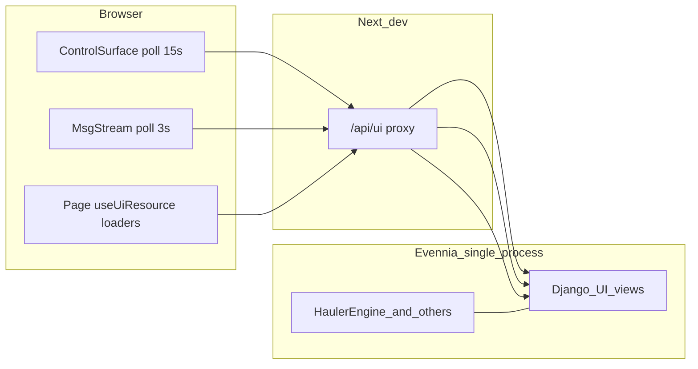

# UI / Evennia performance remediation

## Problem restatement (evidence-based)

- Next dev logs show `**application-code` dominates** `/api/ui/`* latency; the proxy in `[frontend/aurnom/app/api/ui/[...path]/route.ts](frontend/aurnom/app/api/ui/[...path]/route.ts)` only forwards to Evennia.
- **Unauthenticated** `[control_surface_state](game/web/ui/control_surface.py)` returns in ~milliseconds; **authenticated** paths do large synchronous work every poll.
- **Same-process contention**: `[docker-compose.yml](docker-compose.yml)` runs one `evennia start -l` service; game scripts (notably `[HaulerEngine](game/typeclasses/haulers.py)`) and Django views share the reactor-driven process.
- **Expensive patterns in code**:
  - `[claims_market_state](game/web/ui/views.py)` and `[mine_claims](game/web/ui/views.py)` each call `search_tag("mining_site", category="mining")` and iterate — **two full world scans** whenever the claims market page loads.
  - `[ClaimsMarketPanel](frontend/aurnom/components/claims-market-panel.tsx)` mounts **three** `useUiResource` loaders in parallel: `getClaimsMarketState`, `getDashboardState`, `getMineClaimsListable` — stacking duplicate work (dashboard ≈ large overlap with control-surface).
  - `[dashboard_state](game/web/ui/views.py)` repeats the same heavy pattern as authenticated control-surface: `missions.sync_`*, `quests.on_room_enter`, `challenges.sync_all_windows` / `evaluate_window`, ships loop with `search_object`, `owned_production_sites_for_dashboard`, etc.
  - `[HaulerEngine.at_repeat](game/typeclasses/haulers.py)`: up to `**MAX_HAULERS_PER_ENGINE_TICK` (400)** haulers per wake, each up to `**HAULER_MAX_PIPELINE_STEPS` (32)** steps, with `**log_info` per successful step** — long critical sections + log I/O.
- **Client**: `[UI_REFRESH_MS.msgStream` = 3s](frontend/aurnom/lib/ui-refresh-policy.ts), control-surface **15s**, plus `[onChanged` → `reload()` + `router.refresh()](frontend/aurnom/app/(with-missions)/layout.tsx)` multiplies requests.
- **Separate bug**: `TypeError: Cannot set property message` / `unhandledRejection` in the Next container — **not** found as `message =` in app `ts/tsx` sources; treat as Node/Next stack investigation.

---

## Track 1 — Server read models: stop scanning the world per HTTP GET

### 1a. Claims market + mine claims: one cached snapshot

- **Today**: `[claims_market_state](game/web/ui/views.py)` and `[mine_claims](game/web/ui/views.py)` both run `search_tag("mining_site", category="mining")` and filter with `site_is_claims_market_listable` — redundant and O(#mining sites).
- **Target**: Maintain a **periodically refreshed snapshot** (pattern already used for world pipeline in `[_world_production_pipeline_from_telemetry](game/web/ui/control_surface.py)` and market block cache via Django `cache` in the same file).
  - Implement a small **global script** (or extend an existing listings-related script) that on interval rebuilds:
    - listable site rows (same shape as today’s JSON rows),
    - merged property-listing rows (logic currently inline in `claims_market_state`),
    - `nextDiscoveryAt` / any fields the frontend needs.
  - Store snapshot on `script.db` or in Django cache with version key + TTL.
  - **Invalidate or bump generation** on mutations: claim purchase/list endpoints already exist in `[views.py](game/web/ui/views.py)` — call a shared `bump_claims_market_snapshot()` after successful POSTs.
  - `claims_market_state` and `mine_claims` become **O(1) read from snapshot** (mine_claims may filter or use a pre-split “listable for owner” view if semantics differ — preserve current behavior, just avoid second scan).

### 1b. Property deed listings

- `[property_deed_listings_state](game/web/ui/views.py)` calls `[get_property_deed_listings](game/typeclasses/property_deed_market.py)` which walks venues. If profiling shows CPU here (vs pure queueing), apply the **same snapshot + invalidate-on-POST** pattern as 1a (`property_deed_list`, `property_deed_buy` already touch listings).

### 1c. Tests

- Add tests that snapshot contains expected rows after a controlled bootstrap fixture, and that POST purchase/list bumps snapshot (existing test layout under `[game/web/tests/](game/web/tests/)` or `[game/world/tests/](game/world/tests/)`).

---

## Track 2 — Control surface / dashboard: less work per poll

### 2a. Remove duplicate dashboard fetches from the frontend where possible

- **Claims market**: Replace triple parallel load in `[claims-market-panel.tsx](frontend/aurnom/components/claims-market-panel.tsx)` with:
  - **Claims endpoint only** for market rows + embed minimal `{ authenticated, character, message }`** in `claims_market_state` when session present (or a tiny `/ui/session` read), **or** reuse **existing** `[useControlSurface()](frontend/aurnom/components/control-surface-provider.tsx)` for auth/character (already in tree) and drop `getDashboardState` for this panel.
  - `**getMineClaimsListable`**: remove if redundant with claims-market payload after 1a; if still needed, it must hit the **same snapshot** as public claims market (server-side), not a second `search_tag`.

### 2b. Mission / quest / challenge sync on GET

- Today **every** authenticated `[control_surface_state](game/web/ui/control_surface.py)` and `[dashboard_state](game/web/ui/views.py)` call:
  - `char.missions.sync_global_seeds()`, `sync_room`, `quests.on_room_enter`
  - `char.challenges.sync_all_windows()`, `evaluate_window()`
- **Target**: Move “expensive sync” off the **15s poll** path without breaking mission freshness:
  - **Option A (preferred for clarity)**: Run lightweight sync only when **room or character changed** (compare `char.location.id` / puppet id to last-seen on `request.session` or `char.ndb` web cursor); full sync on explicit actions (POST handlers already touch missions in places like `[missions_accept](game/web/ui/views.py)`).
  - **Option B**: Background script updates mission/challenge **dirty flags**; HTTP only serializes.
- Document the contract in code comments so future endpoints do not reintroduce full sync on every GET.

### 2c. Ships serialization

- `[_serialize_ships](game/web/ui/control_surface.py)` / dashboard ship loop uses `search_object(entry)` when entry is not an object — if `owned_vehicles` can be normalized to IDs only, batch-resolve or store resolved refs to avoid N queries per poll.

### 2d. Optional: split control-surface (later phase)

- If still hot after 2a–2c, add **narrow endpoints** or `?fields=` / schema versioning for pages that do not need the full aggregate (larger contract change; defer until metrics say it is needed).

---

## Track 3 — Hauler engine: shorten main-thread holds and log volume

- Constants in `[game/world/time.py](game/world/time.py)` and `[game/typeclasses/haulers.py](game/typeclasses/haulers.py)`:
  - `HAULER_ENGINE_INTERVAL_SEC = 5 * MINUTE`
  - `MAX_HAULERS_PER_ENGINE_TICK = 400`
  - `HAULER_MAX_PIPELINE_STEPS = 32`
- **Changes**:
  - Allow **environment- or settings-driven overrides** for local dev (e.g. lower `MAX_HAULERS_PER_ENGINE_TICK`, lower `HAULER_MAX_PIPELINE_STEPS`, or longer interval) with **documented safe ranges** so production defaults stay economically correct.
  - Demote **per-hauler success** `log_info` in `[at_repeat](game/typeclasses/haulers.py)` to **debug** or **aggregate** (“processed N steps”) to cut disk/CPU from logging under load.
  - Keep `log_err` for failures.
- Wire startup sync in `[at_server_startstop.py](game/server/conf/at_server_startstop.py)` to apply overrides if you introduce env-based tuning (mirror existing hauler interval sync pattern already there).

---

## Track 4 — Client: cooperative polling and fewer redundant refetches

- **Adaptive backoff**: In `[use-msg-stream.ts](frontend/aurnom/lib/use-msg-stream.ts)` and/or `[control-surface-provider.tsx](frontend/aurnom/components/control-surface-provider.tsx)`, if a fetch duration exceeds a threshold (e.g. 2–3s), **temporarily increase** interval (cap at max) until a fast response returns — reduces pile-up when the server is saturated.
- `**reload()` + `router.refresh()`**: In `[with-missions/layout.tsx](frontend/aurnom/app/(with-missions)`/layout.tsx), verify whether **both** are required for RSC vs client state; if one is redundant, drop it to halve work on mission changes.
- **Timeouts**: `[UI_FETCH_TIMEOUT_MS = 45_000](frontend/aurnom/lib/ui-fetch.ts)` matches worst-case observed latency; after server fixes, consider **lower** timeout with **clear error + backoff** so the UI fails fast instead of freezing 45s (only after p95 improves).
- **Align `CLIENT_POLL_HINTS_MS`** in `[game/web/ui/client_poll_hints.py](game/web/ui/client_poll_hints.py)` with tuned client defaults once snapshots land.

---

## Track 5 — Observability

- Add lightweight **per-view timing** (Django middleware or decorator) for `/ui/*` logging route name + ms at INFO when above threshold — proves which endpoint regresses after changes.
- Optional: expose **script tick duration** for `hauler_engine` (last tick wall time in `ndb`) for staff-only debug endpoint.

---

## Track 6 — Next.js `Cannot set property message` TypeError

- **Reproduce with full stack**: run frontend with `NODE_OPTIONS=--trace-uncaught` (or Next `--inspect`) and capture **non–ignore-listed** frames.
- **Search order**: project `grep` (already clean), then **Next** and **fetch** error-normalization paths; fix by **never assigning to `Error`/`DOMException.message`** (use `cause` or wrap in a new Error).
- If isolated to a **dependency**, pin/upgrade or patch; add a **small regression test** only if the fix lives in project code.

---

## Suggested implementation order

1. **Snapshot for claims market + unify `mine_claims` / claims panel fetches** (largest win for claims pages; removes duplicate `search_tag`).
2. **Hauler log demotion + dev-safe caps** (reduces reactor blocking and I/O quickly).
3. **Mission/challenge sync gating** on control-surface and dashboard GET (cuts repeated work every 15s).
4. **Client backoff + remove redundant `router.refresh`**.
5. **Property deed snapshot** if still slow after 1–2.
6. **TypeError** stack trace and fix.

## Success criteria

- p95 **application-code** time for `GET /ui/control-surface`, `GET /ui/msg-stream`, `GET /ui/claims-market`, `GET /ui/mine/claims`, `GET /ui/dashboard` under typical dev load **well below 2s** (target sub-500ms for msg-stream once contention drops).
- Claims market page: **one** primary data fetch on mount (plus control-surface already global).
- No `unhandledRejection` for the `message` getter error in normal navigation.
- Tests cover snapshot invalidation and preserved purchase/list semantics.

