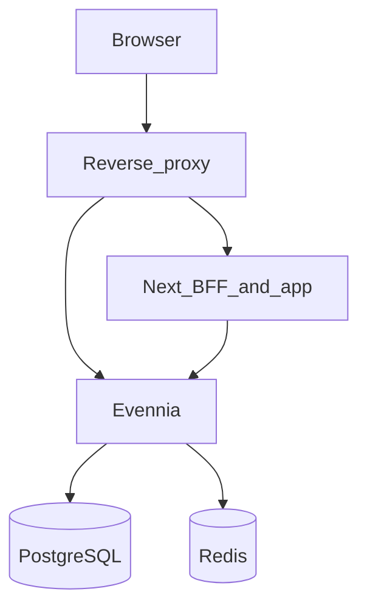

# Web platform: edge, session login, JWT for UI, Redis

## Document control

- **Deliverable type:** Full implementation program (all sections below are in scope for Build).
- **References:** [docker-compose.yml](docker-compose.yml), [game/server/conf/settings.py](game/server/conf/settings.py), [game/web/urls.py](game/web/urls.py), [game/web/ui/urls.py](game/web/ui/urls.py), [evennia/web/website/urls.py](evennia/web/website/urls.py), [frontend/aurnom/app/api/ui/[...path]/route.ts](frontend/aurnom/app/api/ui/[...path]/route.ts), [game/web/middleware_shared_login.py](game/web/middleware_shared_login.py), [evennia/settings_default.py](evennia/settings_default.py). Related latency workstream (parallel): [.cursor/ui_performance_remediation_a0706fa1.plan.md](.cursor/ui_performance_remediation_a0706fa1.plan.md).

## Problem

- Two browser origins in dev (Next vs Evennia web) complicate cookies, CSRF, and product URLs.
- Login is only discoverable via Django routes on the game web port; Next has no first-class login route.
- `/ui/*` today assumes Django session on every request; there is no unified Bearer-JWT layer for the JSON API.
- Django `CACHES` is in-process LocMem; Redis is not in compose; JWT refresh revocation needs a shared TTL store.

## Goals (all required)

1. **Single public hostname** via reverse proxy (TLS in prod, one dev port).
2. **Next `/login`** completes Django session login through that hostname (CSRF-safe); logout wired.
3. **Every `/ui/*` endpoint** authenticates via **JWT** (issue after password login or dedicated token exchange); **401** when missing or invalid. Session remains for `**/auth/*`** HTML and `**/webclient/*`** per [game/web/middleware_shared_login.py](game/web/middleware_shared_login.py) contract.
4. **Redis** runs in compose; Django `CACHES` uses Redis; refresh token rotation / denylist uses the same Redis (or documented keyspace).
5. **Routing decision (fixed):** Edge forwards browser traffic for `**/api/ui/*` to the Next BFF**, which proxies to Evennia `**/ui/*` internal URL** (preserves existing route handler and forwards `Authorization` + cookies as needed). Edge forwards `**/auth/*`**, `**/webclient/*`**, static/media paths to Evennia. Next serves all other app routes.

## Architecture (target)

## Phase A — Edge and Django trust

- Add **Caddy or nginx** to [docker-compose.yml](docker-compose.yml); document the single URL developers and players open.
- Configure [game/server/conf/settings.py](game/server/conf/settings.py): `UPSTREAM_IPS` lists the proxy only; `ALLOWED_HOSTS` and `CSRF_TRUSTED_ORIGINS` match public hostname; production secure cookie flags.
- Set `EVENNIA_BASE_URL` (and related) so Next server-side `fetch` targets the internal Evennia service name.

## Phase B — Session login from Next (bootstrap only)

- Add `GET` JSON CSRF endpoint under [game/web/ui/urls.py](game/web/ui/urls.py) using `ensure_csrf_cookie`.
- Next `/login`: browser `POST` to `/auth/login/` same-origin through edge with `X-CSRFToken`; `?next=` returns user to app shell.
- After successful session login, client immediately calls **token issue** (Phase C) to obtain JWT for `/ui/`* calls (or issue returns tokens in same response if implemented as combined flow—document one flow in implementation).

## Phase C — JWT for all `/ui/`*

- **Spec:** access TTL, refresh TTL, signing secret or keys in env, claims (account id), algorithms.
- **Endpoints:** e.g. `POST /ui/auth/token` (credentials or session-backed exchange), refresh, logout/revoke.
- **Middleware:** validates JWT on paths under `/ui/`*, populates `request.user` from `AccountDB`, **401** if required auth missing. Anonymous-safe endpoints must be explicitly allowlisted.
- **Client:** Next stores access token (memory) and refresh per spec; BFF forwards `Authorization` to Evennia on `/api/ui/`* proxy.
- **CSRF:** Prefer Bearer header for `/ui/`* mutating POSTs to avoid CSRF surface; if any cookie-carried JWT is introduced, add matching CSRF policy.
- **Tests:** expiry, bad signature, allowlist, one mutating POST.

## Phase D — Redis

- Add `redis` service; dependency from Evennia container.
- Override `CACHES` in game settings to `RedisCache`; verify existing keys (market, world graph, deed listings, `cache.add` locks in [game/web/ui/views.py](game/web/ui/views.py)) behave identically.
- Store refresh denylist / jti in Redis with TTL aligned to refresh lifetime.
- Log p95 before/after on representative `/ui/`* for the record (expect minor delta on single process).

## Verification

- One hostname only; no direct `:4001` bookmark required for normal play.
- Session login works; JWT issued; `/api/ui/control-surface` succeeds with `Authorization`.
- Revoked/expired refresh fails; access expiry returns 401 until refresh.
- Redis contains expected keys under load; no functional regressions on cached UI blocks.

## Non-goals

- Multi-shard Evennia or world replication.
- Redis as primary data store.
- Replacing view-level optimization (missions sync, snapshots)—track separately in ui_performance_remediation.

## Risks

- Incorrect `UPSTREAM_IPS` breaks IP-derived behavior.
- Missing allowlist on `/ui/`* breaks anonymous endpoints.
- Order of middleware: JWT must run where `request.user` is needed before views.

