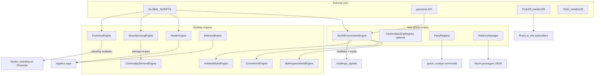

# World simulation: full implementation program

## Scope and constraints

This plan implements **everything** from the prior analysis:

- **Evennia infrastructure:** `GLOBAL_SCRIPTS`, `evennia.utils.gametime`, `TASK_HANDLER` (deferred one-shots), `TICKER_HANDLER` (dense subscriptions), documented rules for when each is used.
- **Economy / industry:** retire unused `[game/typeclasses/market.py](game/typeclasses/market.py)`; add **salvage / disassembly** to manufacturing data and workshop logic; add **throughput / berth caps** to hauler + refinery paths.
- **World state:** in-character **calendar + seasons + weather** (driven by gametime); **per-venue environment** snapshot consumed by ambient/crime/battlespace/challenges.
- **Social / tactical:** **faction standing** (character-scoped, feeds economy modifiers); **instancing** (prototype-based pockets); **party / fleet** registry; **stealth + perception** with room/venue modifiers and challenge signals.

**Non-goals (explicit):** rewriting the entire frontend; replacing `EconomyEngine` with a new ledger; changing Docker topology.

**Critical migration rule (Evennia):** `[evennia/utils/containers.py](evennia/utils/containers.py)` recomputes a pickle-hash of `settings.GLOBAL_SCRIPTS[key]`; if the hash changes, the existing script is **stopped and deleted** and recreated. Therefore:

- First deploy: add `GLOBAL_SCRIPTS` entries with **only** `typeclass` + `persistent: True` (omit `interval`, `repeats`, `start_delay`) so the hash stays stable when you later tune timings inside `at_script_creation`.
- Take a DB backup before the first `GLOBAL_SCRIPTS` rollout.
- After stabilization, you may add timing keys to settings **intentionally** to force recreation (only with migration notes).

---

## Architecture (target)




---

## Phase 0 — Hygiene and single `Script` base

**Files:** `[game/typeclasses/scripts.py](game/typeclasses/scripts.py)`

**Work:**

- Remove the duplicated second `class Script` block and the stale Evennia tutorial docstring (keep one short module doc + one `Script(DefaultScript)`).
- Grep the repo for `from typeclasses.scripts import Script` / `evennia.scripts` usage; ensure nothing relied on the duplicate definition quirk.

**Tests:** `game/world/tests/test_script_base_import.py` (import `Script`, assert single MRO, subclass smoke).

---

## Phase 1 — `GLOBAL_SCRIPTS` as authoritative singleton registry

**Files:**

- `[game/server/conf/settings.py](game/server/conf/settings.py)` — append `GLOBAL_SCRIPTS = { ... }` after imports from defaults.
- Every bootstrap that currently `create_script(...)` for a key listed below: change to `**get_or_assert`** pattern — if missing after `GLOBAL_SCRIPTS.start()`, raise with a clear message (fail loud per project rules). Keep **non-singleton** creation (per-venue listings, `PropertyLotExchangeRegistry` per key, etc.) in bootstraps unchanged.

**Prescriptive `GLOBAL_SCRIPTS` skeleton** (expand to full list during implementation; **omit** interval fields initially):

```python
GLOBAL_SCRIPTS = {
    "global_economy": {"typeclass": "typeclasses.economy.EconomyEngine", "persistent": True},
    "commodity_demand": {"typeclass": "typeclasses.commodity_demand.CommodityDemandEngine", "persistent": True},
    "manufacturing_engine": {"typeclass": "typeclasses.manufacturing.ManufacturingEngine", "persistent": True},
    "economy_world_telemetry": {"typeclass": "typeclasses.economy_world_telemetry.EconomyWorldTelemetry", "persistent": True},
    "economy_automation_controller": {"typeclass": "typeclasses.economy_automation.EconomyAutomationController", "persistent": True},
    "mining_engine": {"typeclass": "typeclasses.mining.MiningEngine", "persistent": True},
    "flora_engine": {"typeclass": "typeclasses.flora.FloraEngine", "persistent": True},
    "fauna_engine": {"typeclass": "typeclasses.fauna.FaunaEngine", "persistent": True},
    "hauler_engine": {"typeclass": "typeclasses.haulers.HaulerEngine", "persistent": True},
    "refinery_engine": {"typeclass": "typeclasses.refining.RefineryEngine", "persistent": True},
    "site_discovery_engine": {"typeclass": "typeclasses.site_discovery.SiteDiscoveryEngine", "persistent": True},
    "npc_miner_registry": {"typeclass": "world.npc_miner_registry.NpcMinerRegistryScript", "persistent": True},
    "property_operation_registry": {"typeclass": "typeclasses.property_operation_registry.PropertyOperationRegistry", "persistent": True},
    "property_operations_engine": {"typeclass": "typeclasses.property_operations_engine.PropertyOperationsEngine", "persistent": True},
    "property_events_engine": {"typeclass": "typeclasses.property_events_engine.PropertyEventsEngine", "persistent": True},
    "property_lot_discovery_engine": {"typeclass": "typeclasses.property_lot_discovery.PropertyLotDiscoveryEngine", "persistent": True},
    "ambient_world_engine": {"typeclass": "typeclasses.ambient_world_engine.AmbientWorldEngine", "persistent": True},
    "crime_world_engine": {"typeclass": "typeclasses.crime_world_engine.CrimeWorldEngine", "persistent": True},
    "battlespace_world_engine": {"typeclass": "typeclasses.battlespace_world_engine.BattlespaceWorldEngine", "persistent": True},
    "mission_seeds": {"typeclass": "typeclasses.mission_seeds.MissionSeedsScript", "persistent": True},
    "system_alerts": {"typeclass": "typeclasses.system_alerts.SystemAlertsScript", "persistent": True},
    "station_contracts": {"typeclass": "typeclasses.station_contracts.StationContractsScript", "persistent": True},
    "space_engagement_new": {"typeclass": "typeclasses.space_engagement.SpaceEngagement", "persistent": True},
    # add new engines from later phases here
}
```

**Bootstrap edits (representative):** `[game/world/bootstrap_economy.py](game/world/bootstrap_economy.py)`, `[game/world/bootstrap_mining.py](game/world/bootstrap_mining.py)`, `[game/world/bootstrap_haulers.py](game/world/bootstrap_haulers.py)`, `[game/server/conf/at_server_startstop.py](game/server/conf/at_server_startstop.py)` — remove redundant `create_script` for keys now in `GLOBAL_SCRIPTS`; retain all **room/bank/NPC** provisioning.

**Tests:** `game/world/tests/test_global_scripts_registry.py` — with Evennia test harness, assert each key resolves via `evennia.GLOBAL_SCRIPTS.get(key)` after start.

---

## Phase 2 — In-character time (`gametime`) and `WorldClock` integration

**Files:**

- `[game/server/conf/settings.py](game/server/conf/settings.py)` — set `TIME_FACTOR`, `TIME_GAME_EPOCH`, `TIME_IGNORE_DOWNTIMES` per [Evennia game-time howto](https://www.evennia.com/docs/latest/Howtos/Howto-Game-Time.html) (choose a sci-fi epoch; document chosen values in code comments only).
- New: `game/world/world_clock.py` — thin helpers wrapping `evennia.utils.gametime` (`game_datetime()`, `time_until`, formatting for UI).
- New: `game/typeclasses/world_clock_script.py` — persistent `Script` with `interval` in **real seconds** (e.g. 60) that:
  - reads gametime tuple;
  - updates `self.db.snapshot` = `{season, hour, day_phase, ...}`;
  - calls a small **internal bus** `world.world_events.emit_tick(game_dt)` (new module) so other systems do not import each other in a cycle.

**Wire consumers (read-only first):**

- `[game/typeclasses/ambient_world_engine.py](game/typeclasses/ambient_world_engine.py)`, crime/battlespace engines — optionally scale weights by `day_phase` / season from snapshot (feature flag on script db).

**Tests:** `game/world/tests/test_world_clock.py` — monkeypatch gametime functions if needed; assert snapshot updates.

---

## Phase 3 — `WorldEnvironmentEngine` (venue weather + conditions)

**New files:**

- `game/world/data/world_environment.json` — schema version, per-venue defaults, transition tables.
- `game/world/environment_loader.py` — strict validation (fail on unknown venue_id vs `[game/world/venues.py](game/world/venues.py)` `all_venue_ids()`).
- `game/typeclasses/world_environment_engine.py` — `Script`, key `world_environment_engine`, `persistent=True`, interval ~300–900s, `at_repeat`:
  - evolve Markov/state machine per venue;
  - store `db.by_venue[venue_id] = {weather, pressure, anomaly, season_bias, ...}`;
  - call `world.challenges.challenge_signals.emit` for **online characters in that venue** only (bounded query via tagged rooms or venue metadata — reuse `[game/world/venue_resolve.py](game/world/venue_resolve.py)` patterns).

**Extend `[game/world/challenges/challenge_signals.py](game/world/challenges/challenge_signals.py)`:**

- Add new event names, e.g. `world_environment_tick`, `weather_shift`, with payloads `{venue_id, weather, ...}`.
- Extend daily trigger sets where appropriate.

**Register:** add to `GLOBAL_SCRIPTS`; bootstrap noop if present.

**Tests:** loader tests + engine unit test with fake venue ids.

---

## Phase 4 — Faction standing (gameplay, not just catalog slugs)

**New files:**

- `game/world/data/factions.json` — faction ids, display names, min/max standing, economy modifier curve.
- `game/world/factions_loader.py` — validation.

**Files:**

- New: `game/typeclasses/faction_standing.py` — `FactionStandingHandler` as `lazy_property` on `[game/typeclasses/characters.py](game/typeclasses/characters.py)` (mirror `ChallengeHandler` pattern), storing `_faction_standing` attribute category with schema version.
- `[game/typeclasses/economy.py](game/typeclasses/economy.py)` — extend `get_price` / modifier path to accept optional `character` and combine:
  - existing item faction slug modifier;
  - **new** standing-based multiplier from handler (no silent default: unknown faction id → `ValueError` in strict code paths used by your own vendors; keep legacy neutral path only where already neutral).

**Emit points:** mission completion hooks, crime/battlespace resolution, vendor transactions — call `handler.adjust_standing(faction_id, delta, reason=...)`.

**Tests:** `game/world/tests/test_faction_standing.py`.

---

## Phase 5 — Remove `MarketScript`; single pricing story

**Files:**

- Delete or empty `[game/typeclasses/market.py](game/typeclasses/market.py)` after grep confirms no imports.
- If any external doc referenced `GLOBAL_SCRIPTS.market`, remove references.

**Rationale:** `[game/typeclasses/economy.py](game/typeclasses/economy.py)` `get_price` + `[game/world/econ_automation/](game/world/econ_automation/)` already own pricing; random wheat/iron/gems is a parallel false economy.

---

## Phase 6 — Salvage / disassembly (manufacturing extension)

**Data:**

- New `game/world/data/manufacturing.d/salvage_recipes.json` (or merged into existing manufacturing JSON with `recipe_kind: "salvage"`).

**Code:**

- `[game/world/manufacturing_loader.py](game/world/manufacturing_loader.py)` — accept salvage recipes; validate inputs reference manufactured or refined keys you allow.
- `[game/typeclasses/manufacturing.py](game/typeclasses/manufacturing.py)` — `Workshop` queue entries support `recipe_kind`; tick path branches to **consume finished good → emit components**; call `[game/typeclasses/commodity_demand.py](game/typeclasses/commodity_demand.py)` supply hooks symmetric to production.

**Web:** extend read models in `[game/web/ui/views.py](game/web/ui/views.py)` / property holding serialization already in `serialize_workshops_for_web`.

**Tests:** recipe round-trip + illegal recipe rejection.

---

## Phase 7 — Logistics caps (hauler + refinery)

**Policy:** caps are **per venue** and **explicit** in `[game/world/venues.py](game/world/venues.py)` venue specs (new keys `logistics: {max_hauler_tons_per_tick, refinery_ingress_cap_tons, ...}`).

**Code:**

- `[game/typeclasses/haulers.py](game/typeclasses/haulers.py)` `HaulerEngine.at_repeat` (or dispatch helper) — clamp scheduled loads; surface **visible** failure (message to plant operators / log line with venue id), no silent drop.
- `[game/typeclasses/refining.py](game/typeclasses/refining.py)` `RefineryEngine` intake from receiving bay — enforce ingress cap with same visibility rules.

**Tests:** `game/world/tests/test_logistics_caps.py`.

---

## Phase 8 — `TICKER_HANDLER` adoption (scalability)

**Policy:**

- Global engines stay **Scripts** for coarse ticks.
- Use `evennia.scripts.tickerhandler.TICKER_HANDLER` for **high-cardinality** per-room or per-object updates when many subscribers share one interval (see docstring in `[evennia/scripts/tickerhandler.py](evennia/scripts/tickerhandler.py)`).

**First concrete use:**

- `[game/typeclasses/rooms.py](game/typeclasses/rooms.py)` — `at_object_receive` / `at_object_leave` subscribe/unsubscribe `Room.at_environment_tick` at a slow interval **only while players present**; tick reads `WorldEnvironmentEngine` snapshot (no DB scan in tick).

**Tests:** Evennia test with add/remove ticker (persistent=True).

---

## Phase 9 — Instancing (prototype pockets)

**New modules:**

- `game/world/instance_prototypes.py` — load `game/world/data/instance_prototypes.json` (graph of room prototypes + exits, not live copies of production rooms).
- `game/typeclasses/instance_anchor.py` — small Object or Exit subtype marking an instance entrance.
- `game/typeclasses/instance_manager.py` — `Script` key `instance_manager`, tracks `db.instances[instance_id] = {owner_id, root_room_id, template_id, expires_at}`.

**API:** commands or web endpoint: `enter_instance(template_id)` → spawn graph, move character; `leave_instance` → return to anchor; garbage-collect empty instances via `TASK_HANDLER` deferred cleanup.

**Tests:** create/destroy lifecycle; no orphan rooms after purge.

---

## Phase 10 — Party / fleet registry

**New:**

- `game/typeclasses/party_registry.py` — `Script` key `party_registry`, `db.parties` structure `{party_id: {leader_id, member_ids, fleet_slug}}`.
- `[game/commands/space_combat.py](game/commands/space_combat.py)` (and related) — resolve party for shared engagement state; emit `challenge_signals.emit` for `party_formed`, `fleet_dispatch`, etc.

**Tests:** membership locks, leader transfer, disband.

---

## Phase 11 — Stealth and perception

**Approach:** extend existing `[evennia.contrib.rpg.traits.TraitHandler](game/typeclasses/characters.py)` with new trait keys (`stealth_rating`, `perception_rating`) in `ensure_default_rpg_traits`.

**New:**

- `game/world/perception_resolve.py` — deterministic contest function `resolve_spot(observer, target, room_mod, environment_mod)`.
- Hook **movement** `[game/typeclasses/characters.py](game/typeclasses/characters.py)` or central move hook if present — emit `challenge_signals.emit(..., "stealth_check", payload)`.

**Environment integration:** `WorldEnvironmentEngine` snapshot contributes modifiers (fog, storm).

**Tests:** table-driven contest tests.

---

## Phase 12 — Startup orchestration and ops

**Files:** `[game/server/conf/at_server_startstop.py](game/server/conf/at_server_startstop.py)`

- After `GLOBAL_SCRIPTS` ownership, simplify interval patching: either move canonical intervals to typeclasses + data, or a single `world/engine_tuning.py` read once at start (avoid scattered magic numbers).

**Monitoring:** optional info-level log summarizing engine tick durations (behind flag on `EconomyWorldTelemetry` or new lightweight metrics script—only if you already have log aggregation).

---

## Phase 13 — Web / control surface (read models only where needed)

**Files:** `[game/web/ui/control_surface.py](game/web/ui/control_surface.py)`, `[game/web/ui/views.py](game/web/ui/views.py)`

- Expose read-only endpoints or embed in existing payloads:
  - gametime + environment snapshot;
  - faction standing (self only);
  - party summary (self only);
  - instance status (self only).

**Frontend:** `[frontend/aurnom/](frontend/aurnom/)` — add panels only where UX already lists sim state; keep API contract typed (TS types mirroring JSON).

---

## Testing and rollout checklist

- Run full `game/world/tests/` after each phase.
- Add **integration** test: cold-start path in Evennia test settings with `GLOBAL_SCRIPTS` populated (may require custom test settings module).
- Staging: backup DB → deploy Phase 1 → verify script rows and keys → proceed.

---

## Execution order (strict)

1. Phase 0 → 1 (registry + bootstrap alignment) before any mass deletions.
2. Phase 2 → 3 (gametime before environment uses it).
3. Phase 5 early once grep clean (remove `MarketScript`).
4. Phases 4, 6, 7 in parallel **after** Phase 1 stabilizes.
5. Phase 8 after Phase 3 (room ticks need snapshot).
6. Phases 9–11 largely independent after Phase 1, but recommend 9 before fleet-wide space hooks if shared instance + fleet overlap.
7. Phase 12–13 last.

