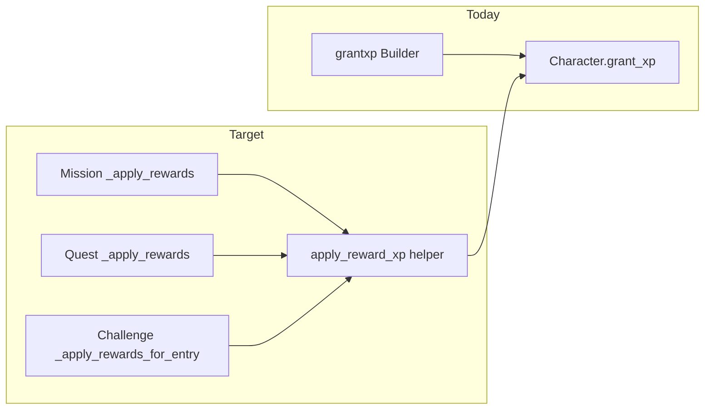

# Wire XP/level to missions, quests, and challenges

## Root cause (verified)

- `[game/world/progression.py](game/world/progression.py)` correctly persists `rpg_level` / `rpg_xp_into_level`.
- `[game/typeclasses/characters.py](game/typeclasses/characters.py)` exposes `grant_xp` → `rules_add_xp` and level-up hooks (`[game/world/progression_rewards.py](game/world/progression_rewards.py)`).
- The only caller today is staff `[game/commands/progression.py](game/commands/progression.py)` (`grantxp`, Builder-only).
- `[game/typeclasses/missions.py](game/typeclasses/missions.py)` `_apply_rewards` and `[game/typeclasses/quests.py](game/typeclasses/quests.py)` `_apply_rewards` only honor `credits`.
- `[game/world/challenges/challenge_handler.py](game/world/challenges/challenge_handler.py)` `_apply_rewards_for_entry` grants `challengePoints` + `credits` only.

## Design decisions

1. **Reward contract:** Add optional integer field `xp` on the same `rewards` objects already merged from templates / choices / objectives (missions) and challenge templates. Mirrors `credits` without a second parallel policy layer (no XP multiplier perks unless you explicitly add one later in `[game/world/point_store/perk_resolver.py](game/world/point_store/perk_resolver.py)`).
2. **Single helper:** One function (e.g. `apply_reward_xp(character, rewards: dict, *, reason: str) -> int`) in `[game/world/progression.py](game/world/progression.py)` (or a tiny adjacent module if you want to avoid growing `progression.py`):
  - Read `xp = int(rewards.get("xp") or 0)`; if `<= 0`, return 0.
  - Require `hasattr(character, "grant_xp")`; if missing, **fail visibly** (raise or log + re-raise) so NPCs or wrong object types do not silently skip XP.
  - Call `character.grant_xp(xp, reason=reason)` (reuses existing player messaging and `[progression]` logging).
3. **Error handling:** Match the existing **credits** pattern in missions/quests: try/except around economy deposit logs errors; for XP, prefer the same boundary—if you want strict parity with “no swallowed errors,” align both in a follow-up; minimally, log failures for XP apply the same way as credits failures so operators see breaks.
4. **Quest objective asymmetry (pre-existing):** Quest `[_complete_objective](game/typeclasses/quests.py)` never calls `_apply_rewards` on per-objective `rewards`; only `[_complete_quest](game/typeclasses/quests.py)` applies template-level `rewards`. **Phase 1** wires `xp` only where `_apply_rewards` already runs (quest completion). **Optional Phase 1b:** apply `dict(objective.get("rewards") or {})` at each quest objective completion (mirror engagement-style mission behavior)—only if your quest JSON already uses objective rewards; otherwise skip to avoid double grants.

## Implementation steps

### 1. Helper + unit tests

- Add `apply_reward_xp` (and optionally `xp_from_rewards(rewards) -> int` for clarity) with tests in e.g. `[game/world/tests/test_progression_xp_rewards.py](game/world/tests/test_progression_xp_rewards.py)`:
  - Positive XP calls `grant_xp` once with correct reason.
  - Zero/missing `xp` no-ops.
  - Object without `grant_xp` raises (or fails loudly per project rule).

### 2. Missions

- In `[game/typeclasses/missions.py](game/typeclasses/missions.py)` `_apply_rewards`, after the credits block (or in parallel branch when `credits <= 0` but `xp > 0`), call the helper with a reason that includes context, e.g. `"mission reward"` or template id if available (pass through optional `template_id` parameter to `_apply_rewards` if you want traceability—otherwise keep signature and use generic reason).
- **Coverage today:** `_complete_mission` merged rewards; engagement objectives apply objective `rewards` before advance. Both paths go through `_apply_rewards`—no change needed to call graph once `_apply_rewards` handles `xp`.
- **Gap (optional):** `visit_room` / `interaction` / `choice` objectives do **not** apply objective `rewards` (only engagement does). Document; do not change unless you intend to grant per-step credits/XP for those objectives.

### 3. Quests

- In `[game/typeclasses/quests.py](game/typeclasses/quests.py)` `_apply_rewards`, invoke the same helper for `xp` (quest completion rewards only, unless Phase 1b).
- If Phase 1b: in `_complete_objective`, before index advance, if `objective.get("rewards")`, call `_apply_rewards` for that dict (ensure templates do not duplicate the same XP at both objective and template level).

### 4. Challenges

- In `[game/world/challenges/challenge_handler.py](game/world/challenges/challenge_handler.py)` `_apply_rewards_for_entry`, after points/credits logic, read `xp` from `rewards`, apply via helper with reason e.g. `f"challenge {cid}"`.
- Extend the return dict / log line to include `xp_granted` for observability (optional but useful).

### 5. Content seeding

- Add `xp` to `rewards` in `[game/world/data/missions.d/*.json](game/world/data/missions.d/)`, `[game/world/data/quests.d/*.json](game/world/data/quests.d/)`, and selected `[game/world/data/challenges.d/*.json](game/world/data/challenges.d/)` where you want progression to move. Use explicit integers (design-tuned), not derived formulas in code for v1.
- Sanity-check: first level needs 1000 XP per `[BASE_XP_PER_LEVEL](game/world/progression.py)`; tune so a typical session of completions produces visible bar movement without instant max level.

### 6. Docs / discoverability (minimal)

- Add a short comment block above `_apply_rewards` in missions and quests documenting supported keys: `credits`, `xp` (and challenges template `rewards` docstring). Avoid new standalone markdown files unless you want them.

## Optional Phase 2 — “other activity”

Only after the above is stable:

- **Station contracts:** `[game/world/station_services/contracts.py](game/world/station_services/contracts.py)` `try_complete_contract`—add optional `xp` on contract rows, call `apply_reward_xp` when completing.
- **Procurement / commodity demand:** `[game/typeclasses/commodity_demand.py](game/typeclasses/commodity_demand.py)` deposit path—optional `xp` on contract row.
- **Mining / refining / other credit grants:** grep for `grant_character_credits` / `econ.deposit` with player-facing memos and decide per-system whether XP belongs (avoid granting XP on every trivial transaction).

## Verification

- In-game: complete a mission/quest/challenge with `xp` in JSON; confirm `rpg_xp_into_level` increases and UI (`[get_rpg_dashboard_snapshot](game/typeclasses/characters.py)`) updates.
- Staff: `grantxp` still works unchanged.
- Run targeted tests: `game/world/tests/test_progression_xp_rewards.py` plus any existing mission/quest handler tests if present.

